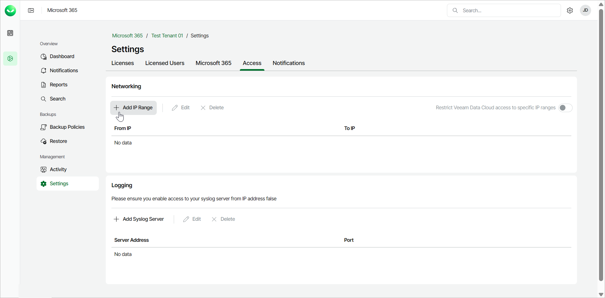
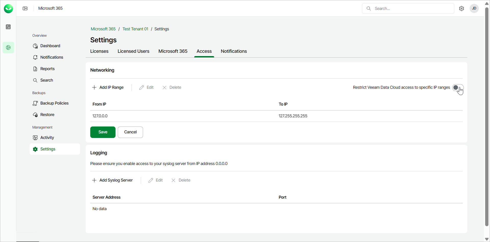
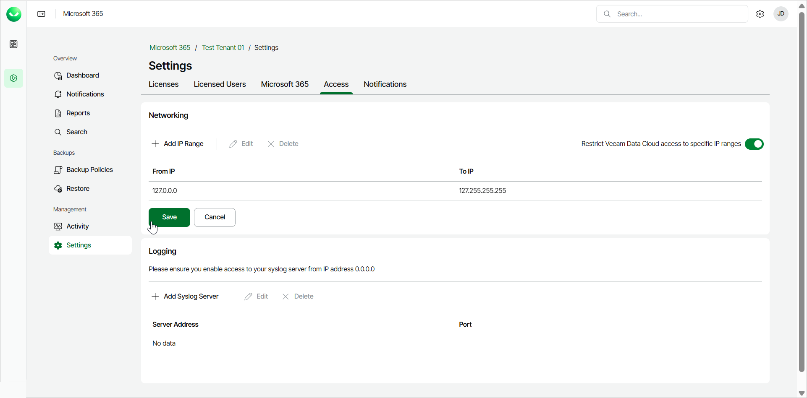

# Configuring Network Access Restrictions

To increase security and control over your data, you can restrict access to Veeam Data Cloud for Microsoft 365 within specific IP address ranges. This approach lets you ensure that only authorized users or devices with IP addresses falling in the defined ranges can access Veeam Data Cloud for Microsoft 365. This can be particularly valuable in scenarios where you want to limit access to specific locations, such as corporate offices.

Configuring network access restrictions within a specified IP address range not only safeguards your data in the event that an account in your tenancy is compromised, but also ensures the overall security of the data.

To configure network restrictions, do the following:

1. On the Microsoft 365 page, click the name of the tenant you want to manage.
2. Select Settings.
3. Select the Access tab.
4. In the Networking section, click Add IP Range.

1. In the Add IP Range window, do the following:

1. In the From IP field, enter the first IP address of the range.
2. In the To IP field, enter the last IP address of the range.
3. Click Save.

Only enter IPv4 addresses. IPv6 addresses are not supported.

Repeat this step if you want to restrict multiple IP address ranges.

1. Click the Restrict Veeam Data Cloud access to specific IP ranges toggle to apply the specified settings.

1. Click Save.

|  |
| --- |
| NOTE |
| If network settings in your organization change unexpectedly, preventing access to your Veeam Data Cloud for Microsoft 365 instance, you can reach out to Veeam Customer Support for assistance in updating or temporarily removing the associated IP address ranges. In such cases, Veeam may require you to provide verification for security purposes. |

