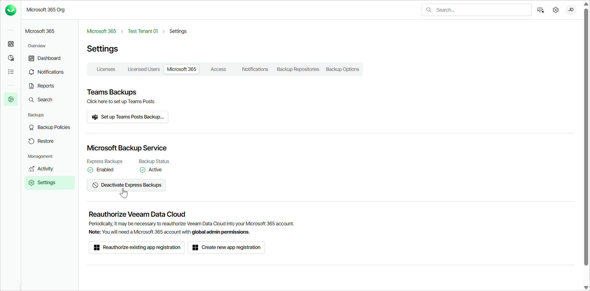
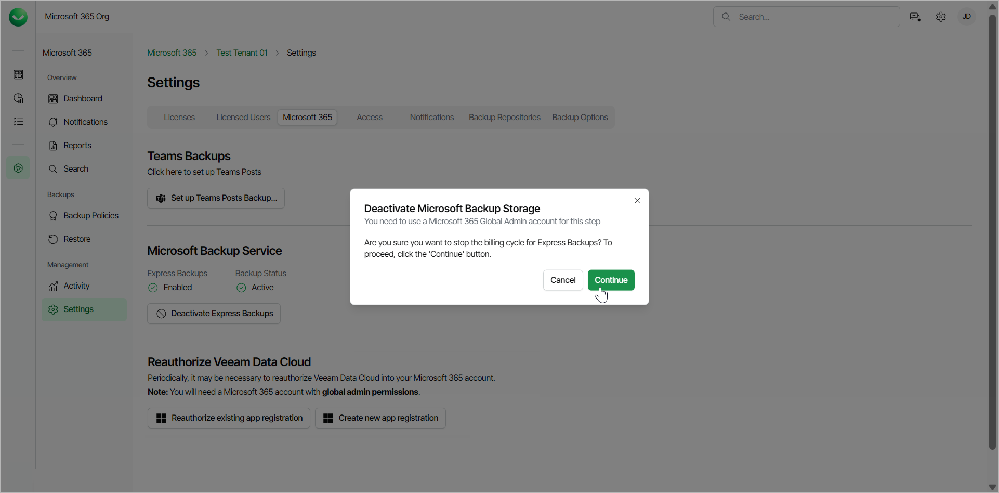

# Enabling Express Backup

To activate and enable Express backup, your organization must have an active Premium Veeam Data Cloud for Microsoft 365 subscription. You must activate the Express backup service to start creating Express backup policies.

Activating Express Backup

If you have successfully established the Express connection when you [added the Microsoft 365 tenant to Veeam Data Cloud](m365_tenant_add.md), the Express backup service is already active for the tenant.

If you skipped the Express connection step or purchased a Premium subscription after adding a Microsoft 365 tenant to Veeam Data Cloud, you must activate the Express backup service. To do that, do the following:

1. On the Microsoft 365 page, click the name of the tenant you want to manage.
2. Select Settings.
3. Go to the Microsoft 365 tab.
4. In the Microsoft Backup Service section, click Set up Express Backups.

1. In the Microsoft authentication window, select the Microsoft account under which you want to authenticate against Microsoft 365. The account must have the Microsoft 365 Global Admin role. (If a Microsoft 365 Global Admin has already granted consent during onboarding, then the account must have the Microsoft 365 Backup Admin role.)
2. Accept the required permissions.
3. Return to Veeam Data Cloud. Once the Express backup service is activated, the Express Backups field changes from Disabled to Enabled and the Backup Status field changes from NotFound to Active.

Deactivating Express Backup

If you want to stop the billing cycle for your Express backup policies and deactivate the Express Backup service, you must first delete all Express backup policies. For information on how to delete backup policies, see [Managing Backup Policies](m365_backup_manage.md).

After you delete the Express backup policies, do the following:

1. On the Microsoft 365 page, click the name of the tenant you want to manage.
2. Select Settings.
3. Go to the Microsoft 365 tab.
4. In the Microsoft Backup Service section, click Deactivate Express Backups.

1. In the Deactivate Microsoft Backup Storage window, click Continue.

1. In the Microsoft authentication window, select the Microsoft account under which you want to authenticate against Microsoft 365. The account must have the Microsoft 365 Backup Admin role.
2. Accept the required permissions.
3. Return to Veeam Data Cloud. Once the Express backup service is deactivated, the Express Backups field changes from Enabled to Disabled and the Backup Status field changes from Active to NotFound.

