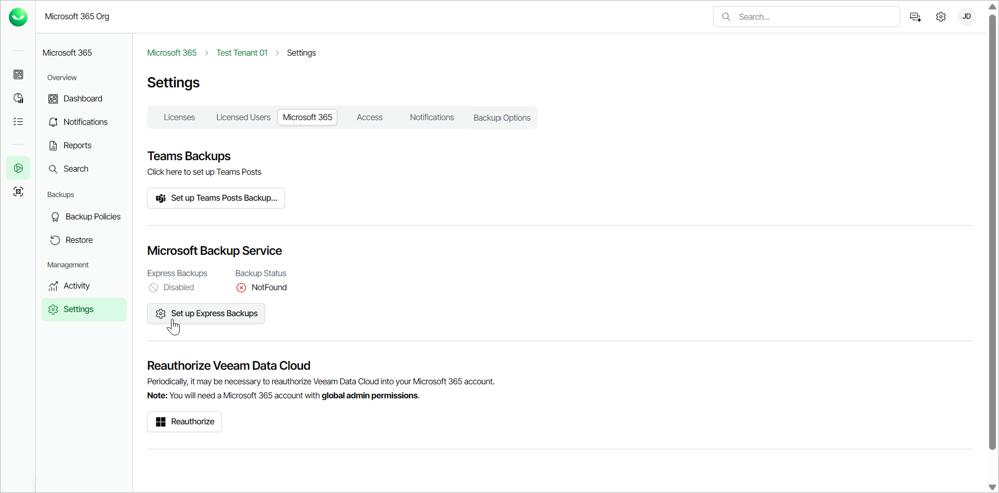
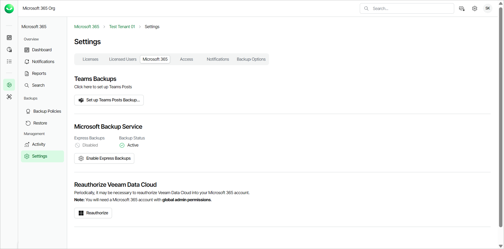
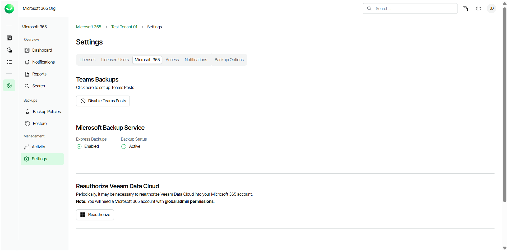

# Enabling Express Backup

To activate and enable Express backup, your organization must have an active Premium Veeam Data Cloud for Microsoft 365 subscription. You must first activate the Express backup service and then enable Express backup to start creating Express backup policies.

Activating Express Backup

If you have successfully established the Express connection when you [added the Microsoft 365 tenant to Veeam Data Cloud](m365_tenant_add.md), the Express backup service is already active for the tenant. To enable Express backup, follow the [Enabling Express Backup](#enable) procedure steps.

If you skipped the Express connection step or purchased a Premium subscription after adding a Microsoft 365 tenant to Veeam Data Cloud, you must activate the Express backup service. To do that, do the following:

1. On the Microsoft 365 page, click the name of the tenant you want to manage.
2. Select Settings.
3. Go to the Microsoft 365 tab.
4. In the Microsoft Backup Service section, click Set up Express Backups.

1. In the Microsoft authentication window, select the Microsoft account under which you want to authenticate against Microsoft 365. The account must have the Microsoft 365 Global Admin permissions.
2. Accept the required permissions.
3. Return to Veeam Data Cloud. Once the Express backup service is activated, the Backup Status field changes from NotFound to Active.

1. To enable Express backup, follow the [Enabling Express Backup](#enable) procedure steps.

Enabling Express Backup

In order to enable Express backup, the Express backup service must be in the Active state. For information on how to activate the service, see [Activating Express Backup](#activate).

To enable Express backup, do the following:

1. On the Microsoft 365 page, click the name of the tenant you want to manage.
2. Select Settings.
3. Go to the Microsoft 365 tab.
4. In the Microsoft Backup Storage section, click Enable Express Backups.

1. In the Enable Microsoft Backup Storage window, click Enable Express Backups.

1. The Express Backups field changes from Disabled to Enabled. To start protecting your data, you can [create Express backup policies](m365_backup_create_express.md).

