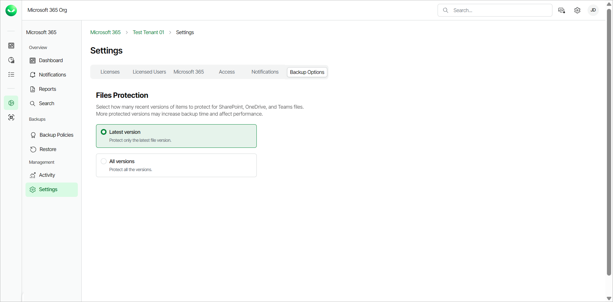

# Managing Backup Options

For SharePoint Online, OneDrive and Teams items, Veeam Data Cloud for Microsoft 365 backs up the latest version of the item by default. More protected versions may increase backup time and affect performance.

To manage backup options for a workload tenant, do the following:

1. On the Microsoft 365 page, click the name of the tenant you want to manage.
2. Select Settings.
3. Go to the Backup Options tab.
4. In the Files Protection section, select one of the following options:

* Latest version. Select this option to protect only the latest version of a file.
* All versions. Select this option to protect all versions of a file. If you switch to this option, the backups will include all the versions of the item created after the latest backed-up version.

For example, you use the Latest version option and the backed-up item version is 3. You switch to the All versions option. The production version of the item is 5. Veeam Data Cloud will back up versions 4 and 5. If the production version and the backed-up version are the same, no new data will be backed-up.

Page updated 2026-07-10
