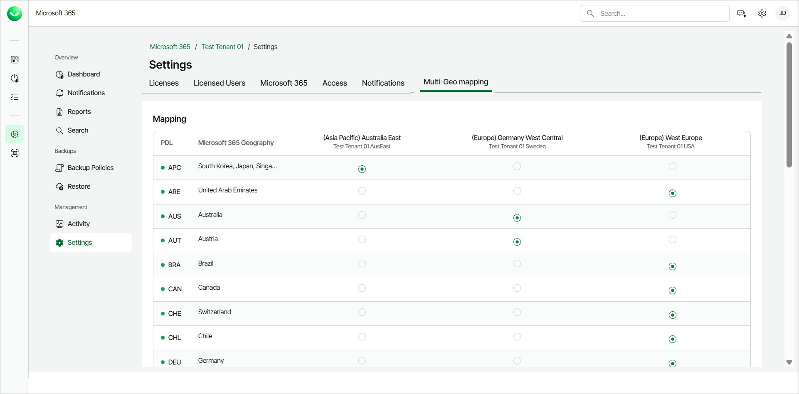
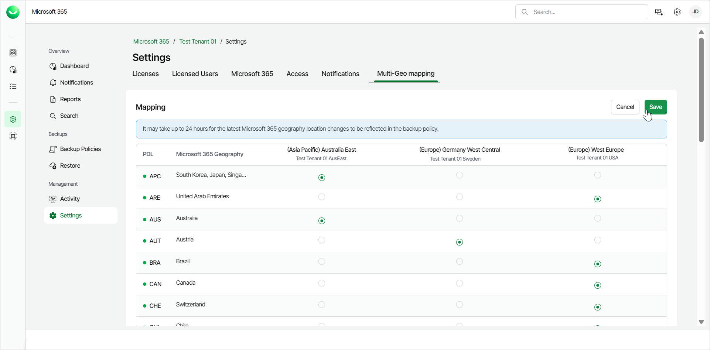

# Mapping Multi-Geo Regions

Veeam Data Cloud for Microsoft 365 allows you to modify the region mapping for your multi-geo Microsoft 365 tenants.

To change the region for a multi-geo tenant, do the following:

1. On the Microsoft 365 page, click the name of the tenant you want to manage.
2. Select Settings.
3. Go to the Multi-Geo mapping tab.

1. In the Mapping section, you can see all the available regions and the tenants you mapped to them when you added the the multi-geo tenancy in Veeam Data Cloud. Select the region you want to change under the correct tenant.
2. Click Save. The change may take up to 24 hours.

