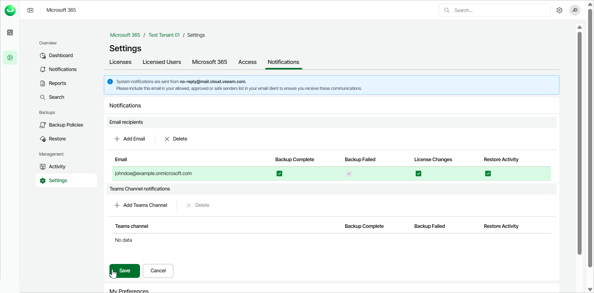
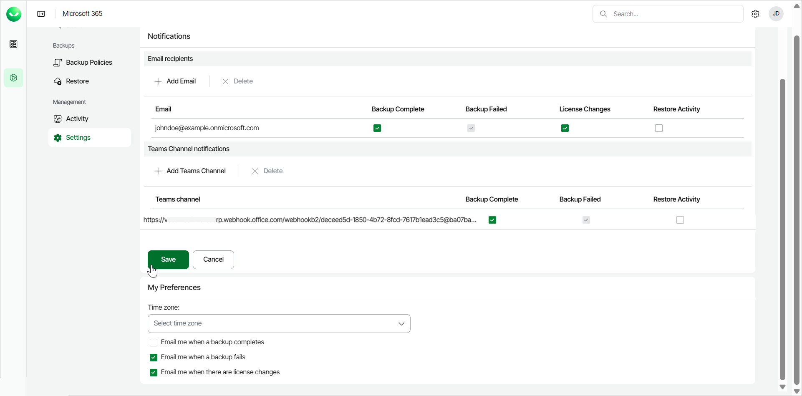
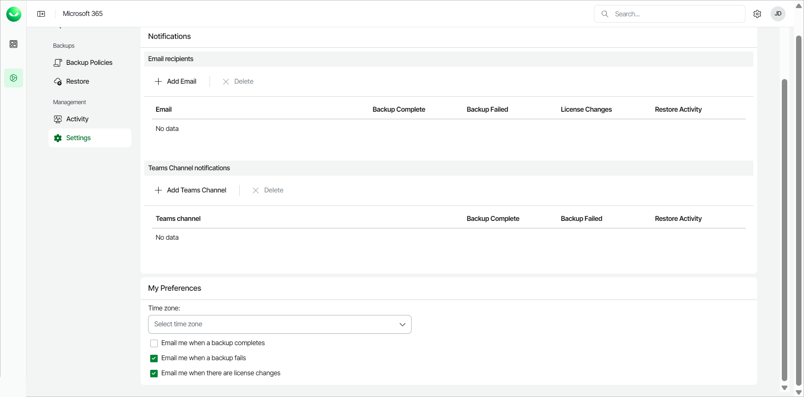

# Managing Notifications

In this article

Veeam Data Cloud for Microsoft 365 allows you to configure email recipients for Veeam Data Cloud for Microsoft 365 system notifications and add Microsoft Teams channels where you can receive Veeam Data Cloud for Microsoft 365 system notifications.

|  |
| --- |
| note |
| Veeam Data Cloud for Microsoft 365 email notifications are sent from the no-reply@mail.cloud.veeam.com email address. To ensure you receive all communications from Veeam Data Cloud for Microsoft 365, you must include no-reply@mail.cloud.veeam.com in your allowed, approved or safe senders list in your email client. |

Email Recipients

To configure email recipients for system notifications, do the following:

1. On the Microsoft 365 page, click the name of the tenant you want to manage.
2. Select Settings.
3. Select the Notifications tab.
4. In the Email recipients section, click Add Email.
5. In the Add email for notifications window, add the email address of the user and click Ok.
6. Select the check boxes for the notifications you want the user to receive. The available notifications are the following:

* Backup Complete. Receive hourly notifications about the backup status.
* Backup Failed. Receive hourly notifications about the backup status. If you select the Backup Complete check box, the Backup Failed check box is selected as well.
* License Changes. Receive notifications when there are changes in the total number of licensed users whose data is protected.
* Restore Activity. Receive notifications about restore process activities.

1. Click Save.

|  |
| --- |
| NOTE |
| If a user configures email notifications from their My Preferences section and they are also one of the email recipients in the Notifications settings page, they will receive the system notifications twice. For more information on My Preferences settings, see [My Preferences](#mypref). |

Teams Channel Notifications

To configure Microsoft Teams channel notifications, do the following:

1. Create an incoming webhook in Teams. To do that, follow the instructions in [this Microsoft article](https://learn.microsoft.com/en-us/microsoftteams/platform/webhooks-and-connectors/how-to/add-incoming-webhook?tabs=newteams%2Cdotnet#create-an-incoming-webhook). You must copy and save the unique webhook URL that is generated in the end of the process, because you need it for the configuration in Veeam Data Cloud for Microsoft 365.
2. In Veeam Data Cloud for Microsoft 365, on the Microsoft 365 page, click the name of the tenant you want to manage.
3. Select Settings.
4. Select the Notifications tab.
5. In the Teams Channel notifications section, click Add Teams Channel.
6. In the Teams channel notifications window, add the webhook URL that you copied from Teams in Step 1 and click Ok.
7. Select the check boxes for the notifications you want to receive in your Teams channel. The available notifications are the following:

* Backup Complete. Receive notifications when the backup process is completed.
* Backup Failed. Receive notifications when the backup process has failed. If you select the Backup Complete check box, the Backup Failed check box is selected as well.
* Restore Activity. Receive notifications about restore process activities.

1. Click Save.

My Preferences

In the My Preferences section, you can manage your time zone and notifications settings. To do that, do the following:

1. In the Time zone drop-down list, select a time zone. This setting affects the time shown in the email notifications you receive from Veeam Data Cloud for Microsoft 365. By default, Veeam Data Cloud for Microsoft 365 uses the UTC time zone.
2. Select the check box next to the email notifications you want to receive from Veeam Data Cloud for Microsoft 365:

* Email me when a backup completes. Receive an email notification when the backup process completes.
* Email me when a backup fails. Receive an email notification when the backup process fails.
* Email me when there are license changes. Receive an email notification when there are changes in the number of licensed users. Veeam Data Cloud for Microsoft 365 checks for license changes every Monday, Wednesday and Friday at 9:00 PM of your configured time zone.

If you select any of the check boxes, you will receive email notifications even if your email address is not added as an email recipient for system notifications. If your email address is also added as an email recipient for system notifications, you will receive the email notifications twice. For more information about email recipients for system notifications, see [Email Recipients](#recip).

Page updated 12/1/2025
