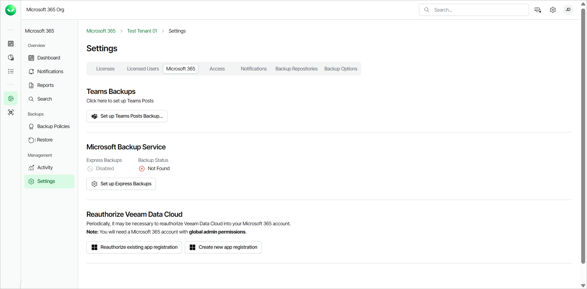

# Reauthorizing Veeam Data Cloud for Microsoft 365

You may need to reauthorize Veeam Data Cloud access to your Microsoft 365 tenant. This may be required in the following cases:

* If you have accidentally removed authorization for Veeam Data Cloud to access your Microsoft 365 data.
* If you see the following error message in the backup session logs: The identity of the calling application could not be established.
* If Veeam Data Cloud displays the You cannot enable Teams Posts due to missing required permissions. Please reauthorize your app registration and try again. notification when you enable team posts backups.

To reauthorize Veeam Data Cloud, do the following:

1. On the Microsoft 365 page, click the name of the tenant you want to manage.
2. Select Settings.
3. Go to the Microsoft 365 tab.
4. In the Reauthorize Veeam Data Cloud section, do one of the following:

* Click Reauthorize existing app registration to reauthorize and continue using your existing application registration.
* Click Create new app registration, to create a new application registration.

|  |
| --- |
| NOTE |
| If you select to create a new app registration, you must enable team posts backup again. For more information, see [Enabling Microsoft Team Posts Backup](m365_enable_team_chats_backup.md). |

1. Select the Microsoft account under which you want to authenticate against Microsoft 365. The account must have the Microsoft 365 Global Admin permissions.
2. Accept the required permissions.

