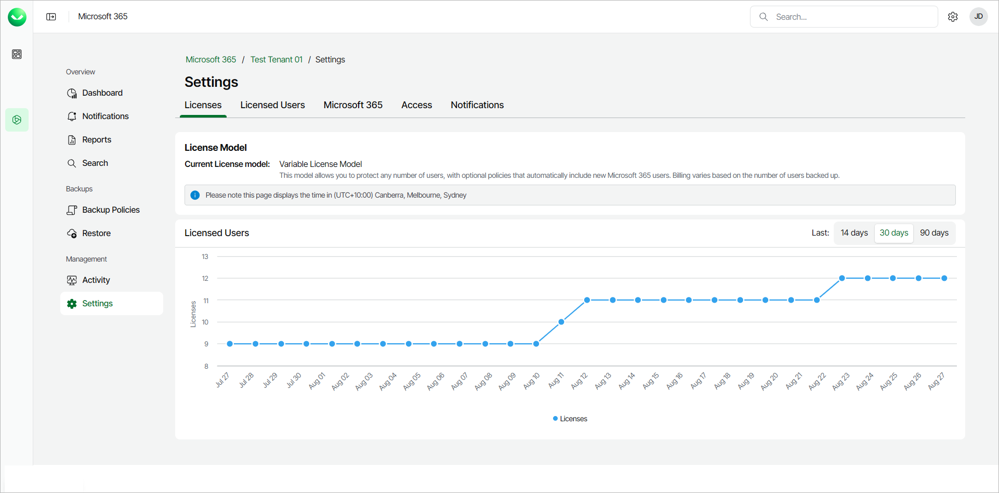

# Viewing License Details

You can view information about the license model you use, licenses and licensed users.

To view license details, take the following steps:

1. On the Microsoft 365 page, click the name of the tenant you want to manage.
2. Select Settings.
3. Select the Licenses tab.

