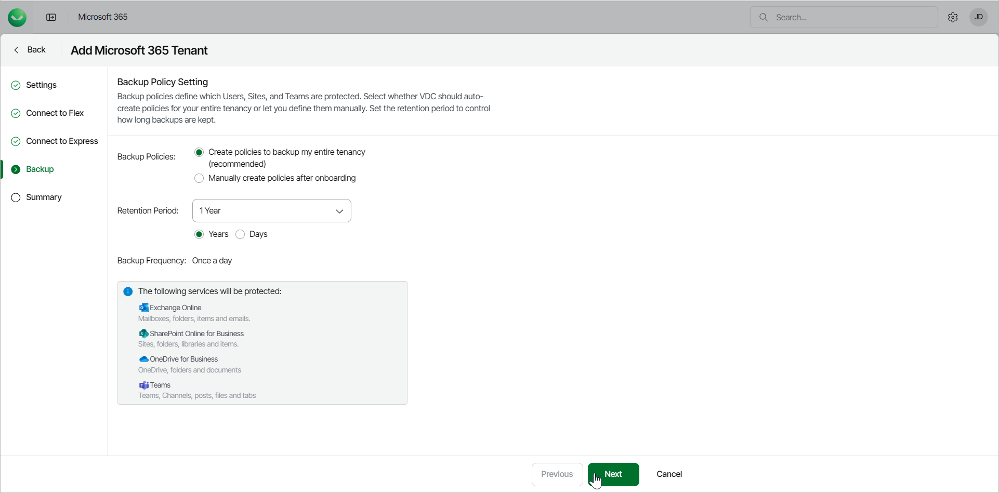

# Step 5. Configure Backup Policy

In this article

At the Backup step of the wizard, select whether Veeam Data Cloud for Microsoft 365 should automatically configure backup policies or let you manually create the policies after onboarding.

1. In Backup Policies, select one of the following options:

1. Create policies to back up my entire tenancy. This option is recommended and enables automatic backup policies for all users, sites and teams.

* Retention Period. Set the number of Years or Days for the retention period of your backups.

1. Manually create policies after onboarding. This option allows you to manually set your backup policies after onboarding.

1. Click Next.

Page updated 10/13/2025
