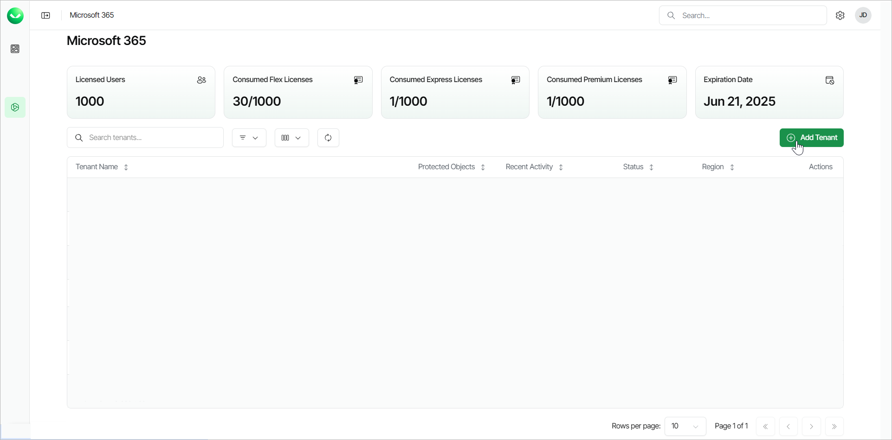

# Step 1. Launch Add Microsoft 365 Tenant Wizard

In this article

To launch the Add Microsoft 365 tenant wizard, do the following:

1. To open the list of Microsoft 365 tenants, click Microsoft 365 on the left.
2. Click Add Tenant.

|  |
| --- |
| Note |
| If you are a customer of a Veeam Cloud & Service Provider partner, you cannot launch the Add Microsoft 365 tenant wizard. Ask your service provider to add your Microsoft 365 tenant or send you an email with an invitation link that allows you to launch the wizard. |

Page updated 11/13/2025
