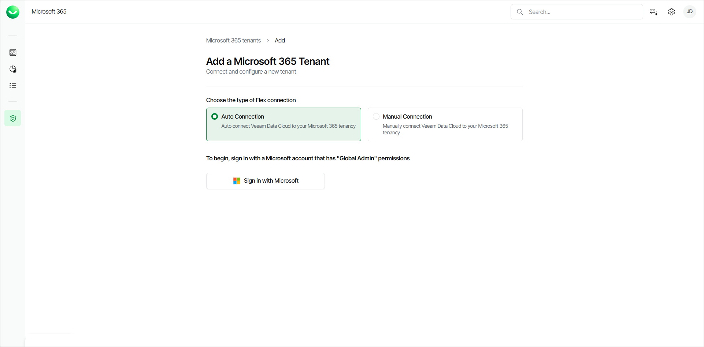
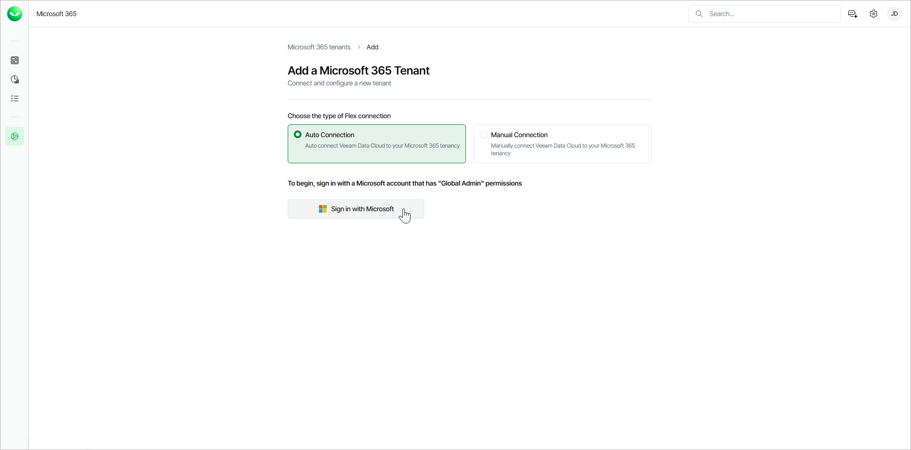
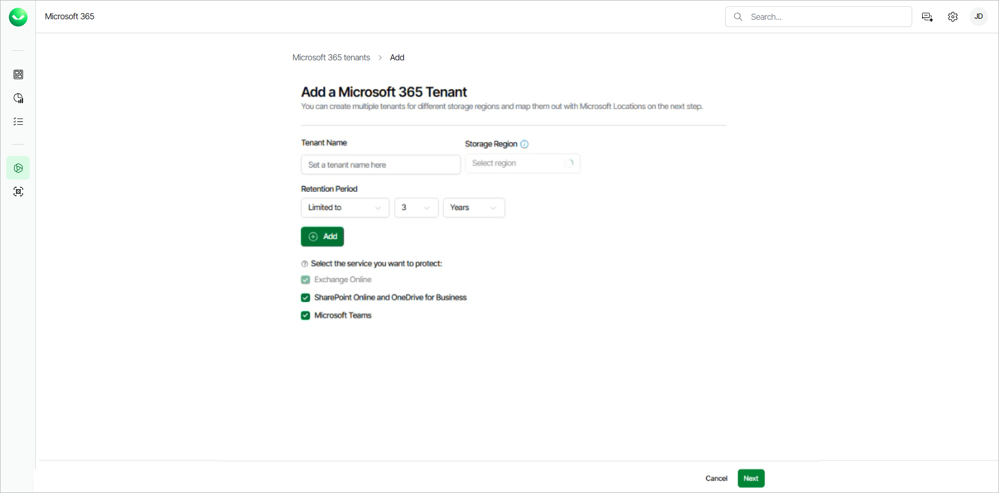
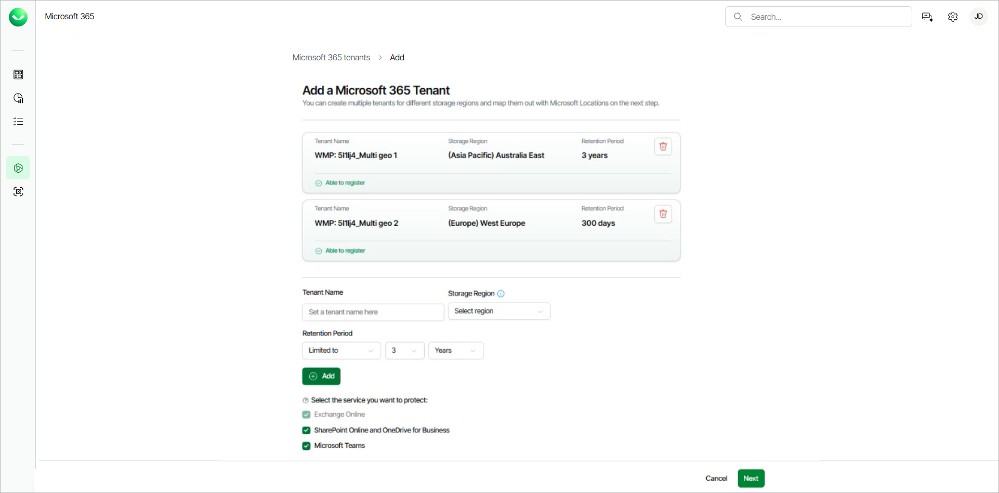
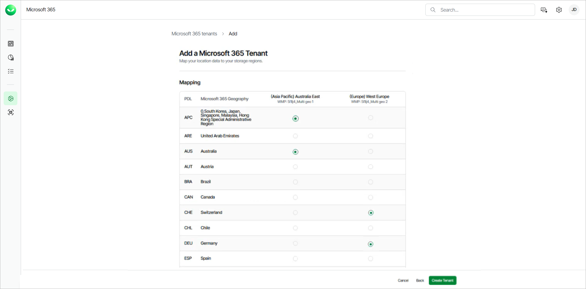

# Adding Multi-Geo Microsoft 365 Tenants

To start protecting multi-geo Microsoft 365 tenant data, you must add the multi-geo Microsoft 365 tenant to Veeam Data Cloud.

Consider the following:

* Before you start adding the multi-geo tenant, check [Considerations and Limitations](m365_considerations_limitations.md).
* Veeam Data Cloud supports multi-geo tenants for customers under the Foundation or Advanced plans.

To add a multi-geo Microsoft 365 tenant, use the Add Microsoft 365 tenant wizard and do the following:

1. Click Microsoft 365 on the left to open the list of Microsoft 365 tenants.
2. Click Add Tenant.

1. Choose how you want to connect Veeam Data Cloud to the multi-geo Microsoft tenancy:

* Auto Connection. Select this option if you want to automatically connect Veeam Data Cloud to the multi-geo Microsoft tenancy. This option is recommended and selected by default. Follow the [Automatic Connection Steps](#automatic) instructions to proceed.
* Manual Connection. Select this option if you want to manually connect  Veeam Data Cloud to the multi-geo Microsoft tenancy. Follow the [Manual Connection Steps](#manually) instructions to proceed.

Automatic Connection Steps

|  |
| --- |
| note |
| To perform the steps successfully, you must use a Microsoft 365 Global Admin account. |

If you choose to automatically connect Veeam Data Cloud to your multi-geo Microsoft 365 tenancy (recommended), do the following:

1. In the Choose the type of Flex connection section, select Auto Connection.
2. Click Sign in with Microsoft.

1. In the Microsoft authentication window, select the Microsoft account under which you want to authenticate against Microsoft 365. The account must have the Microsoft 365 Global Admin permissions.
2. Accept the required permissions.
3. Return to Veeam Data Cloud and specify the multi-geo tenant settings:

1. In the Tenant Name field, specify a name for the new tenant.
2. From the Storage Region drop-down list, select a Microsoft Azure region where the backup infrastructure and storage will be provisioned.

For information on supported Microsoft Azure regions, see [Backup Storage Regions](m365_region_availability.md).

1. In the Retention Period section, set the number of Years or Days for the retention period of your backups, or select Unlimited to keep the backups for an indefinite time.

Once you set the retention period, you cannot reduce it. For more information, see [Backup Retention](m365_data_backup.md#retention).

1. In the Select the service you want to protect section, make sure to select only the services that are available in the Microsoft 365 tenant that you are connecting to.

1. To add more tenants, repeat step 5 and click Add for each new tenant.

To remove any of the added tenants, click the delete icon next to the tenant.

1. Once you add all the tenants you want to add, click Next.

1. In the Mapping section, map your location data to storage regions for each tenant.

1. Click Create Tenant.
2. Once the tenants are provisioned, you can [create backup policies](m365_backup_create_flex.md) for each tenant and [modify the region mapping](m365_settings_map_multigeo_regions.md).

Manual Connection Steps

If you choose to manually connect Veeam Data Cloud to the multi-geo Microsoft 365 tenancy, do the following:

1. In Microsoft Entra ID, do the following:

1. Create a new App Registration.
2. Assign the [required permissions](m365_permissions.md) to the new application registration.
3. Create and assign a certificate to the application.

X.509 compatible certificates from a trusted CA (Certificate Authority) and self-signed certificates are supported. For more information, see [this Microsoft article](https://learn.microsoft.com/en-us/entra/identity-platform/how-to-add-credentials?tabs=certificate).

1. Export the certificate to a PFX file. You will use this file at step 4-c of this procedure.
2. On the overview page of the application, copy the Application (client) ID value.

1. In Veeam Data Cloud for Microsoft 365, in the Choose the type of Flex connection section, select Manual Connection.
2. Specify the following:

1. In the User Account Email field, type the email address of a Microsoft 365 user account that belongs to your multi-geo Microsoft 365 tenant.
2. In the App Registration ID field, type the Application (client) ID value that you copied during the application registration in Microsoft Entra ID.
3. In the App Certificate field, click Browse and select the PFX certificate file that you exported from Microsoft Entra ID.
4. In the Certificate Password field, only type the password if you have exported the certificate with password protection enabled.

1. Click Connect.
2. Specify the multi-geo tenant settings:

1. In the Tenant Name field, specify a name for the new tenant.
2. From the Storage Region drop-down list, select a Microsoft Azure region where the backup infrastructure and storage will be provisioned.

For information on supported Microsoft Azure regions, see [Backup Storage Regions](m365_region_availability.md).

1. In the Retention Period section, set the number of Years or Days for the retention period of your backups, or select Unlimited to keep the backups for an indefinite time.

Once you set the retention period, you cannot reduce it. For more information, see [Backup Retention](m365_data_backup.md#retention).

1. In the Select the service you want to protect section, make sure to select only the services that are available in the Microsoft 365 tenant that you are connecting to.

1. To add more tenants, repeat step 5 and click Add for each new tenant.
2. Once you add all the tenants you want to add, click Next.

1. In the Mapping section, map your location data to storage regions for each tenant.

1. Click Create Tenant.
2. Once the tenants are provisioned, you can [create backup policies](m365_backup_create_flex.md) for each tenant and [modify the region mapping](m365_settings_map_multigeo_regions.md).

|  |
| --- |
| tip |
| To ensure the manual connection is successful, confirm the following:   * You created an application registration in your Microsoft Entra ID and not an Enterprise application. * The manually created app registration is within the correct tenant ID. For more information, see [this Microsoft article](https://learn.microsoft.com/en-us/sharepoint/find-your-office-365-tenant-id). * You assigned all the required permissions to the application registration and ensured that all required permissions are consented to. For more information, see [this Microsoft article](https://learn.microsoft.com/en-us/entra/identity-platform/application-consent-experience). |

