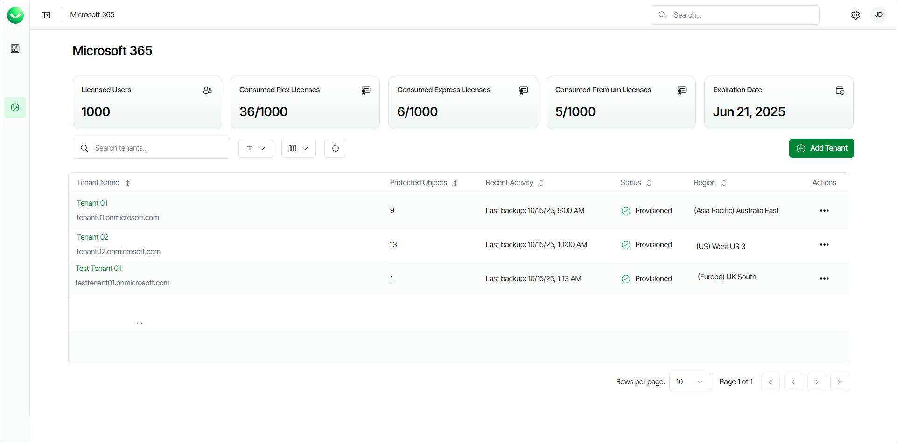

# Viewing Microsoft 365 Tenants

On the Microsoft 365 page, you can view all added Microsoft 365 workload tenants and information about the Veeam Data Cloud for Microsoft 365 subscription. You can also add a new Microsoft 365 tenant. For details on adding tenants, see [Adding Microsoft 365 Tenants](m365_tenant_add.md).

To view the Microsoft 365 page, select Microsoft 365 on the left or click Microsoft 365 on the overview page.

In the upper section, Veeam Data Cloud displays the following information:

* The Licensed Users field shows how many licenses are available in the subscription.
* The Consumed Flex Licenses field shows how many Flex licenses you are currently using.
* The Consumed Express Licenses field shows how many Express licenses you are currently using.
* The Consumed Premium Licenses field shows how many Premium licenses you are currently using.
* The Expiration Date field shows when the subscription will expire.

For details on Veeam Data Cloud for Microsoft 365 licenses, see [Licensing](m365_licensing.md).

Tenant Properties

In the tenants list, Veeam Data Cloud displays the following properties for each tenant:

| Property | Description |
| --- | --- |
| Tenant Name | The name that you specified when adding the tenant and the primary domain name of the Microsoft 365 tenancy where this Veeam Data Cloud for Microsoft 365 tenant is connected. |
| Protected Objects | The total number of Microsoft 365 objects that Veeam Data Cloud backs up in this tenant. |
| Recent Activity | The date and time when Veeam Data Cloud finished the last successful backup of the tenant. |
| Status | The current state of the tenant. For details, see [Tenant Statuses](#tstatus). |
| Region | The region where Veeam Data Cloud stores backed-up data. For information on supported regions, see [Backup Storage Regions](m365_region_availability.md). |

Tenant Statuses

A Microsoft 365 tenant can have one of the following statuses:

| Status | Description |
| --- | --- |
| Provisioning | Veeam Data Cloud is provisioning a new tenant after you finished the Add Microsoft 365 tenant wizard. |
| Provisioned | The infrastructure for the tenant is ready and you can manage the tenant. Tenant management may be temporarily unavailable due to the following reasons:   * Planned maintenance is in progress. * You do not have permission to manage the tenant. To get permission, an administrator of your Veeam Data Cloud organization must assign the M365:Administrator or M365:BackupOperator role to you and add this tenant to the role scope. For details, see [Editing Users](users_edit.md). |
| Provision failed | The infrastructure deployment was not successful. Click Actions and select Retry to correct any issues (insufficient [permissions](m365_permissions.md), network stability and so on) and retry adding the tenant. If the issue persists, [submit a support case](https://my.veeam.com/my-cases). |
| Deprovisioning | The subscription has expired and Veeam Data Cloud is suspending the backup policies in the tenant. After the backup policies are suspended, the tenant status changes to In retention. |
| Deprovisioning failed | Veeam Data Cloud was unable to suspend the backup policies. To resolve the issue, [submit a support case](https://my.veeam.com/my-cases). |
| In retention | The subscription has expired and Veeam Data Cloud will handle the backed-up data according to the [Veeam Data Cloud Service Agreement](https://www.veeam.com/legal/veeam-data-cloud-service-agreement.html). |
| Reactivating | Veeam Data Cloud is activating the backup policies after the expired subscription was renewed within the retention period. After the backup policies are activated, the tenant status changes to Provisioned. |
| Reactivating failed | Reactivation of the backup policies in the tenant was not successful. To resolve the issue, [submit a support case](https://my.veeam.com/my-cases). |
| Deleting | The retention period has expired and Veeam Data Cloud is removing the tenant and all related data. |
| Deleting failed | Deletion of the tenant was not successful. To resolve the issue, [submit a support case](https://my.veeam.com/my-cases). |

|  |
| --- |
| tip |
| If you want to delete a tenant, contact Veeam Customer Support. |

