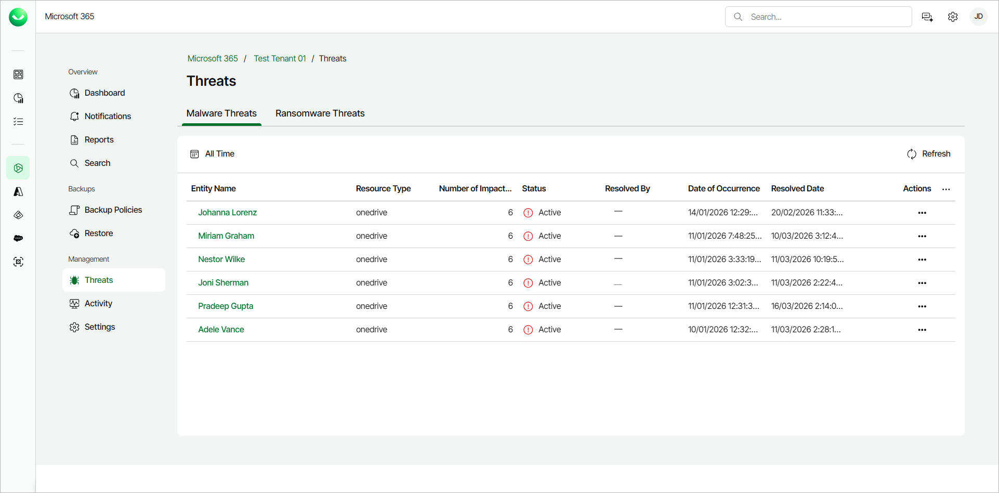
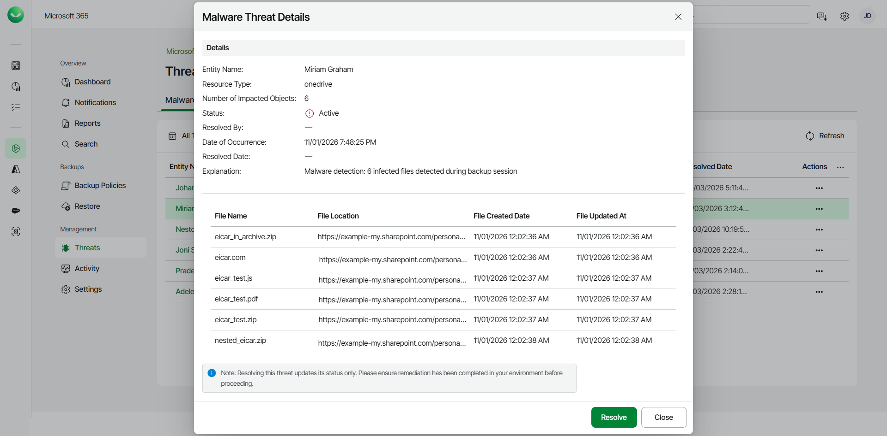
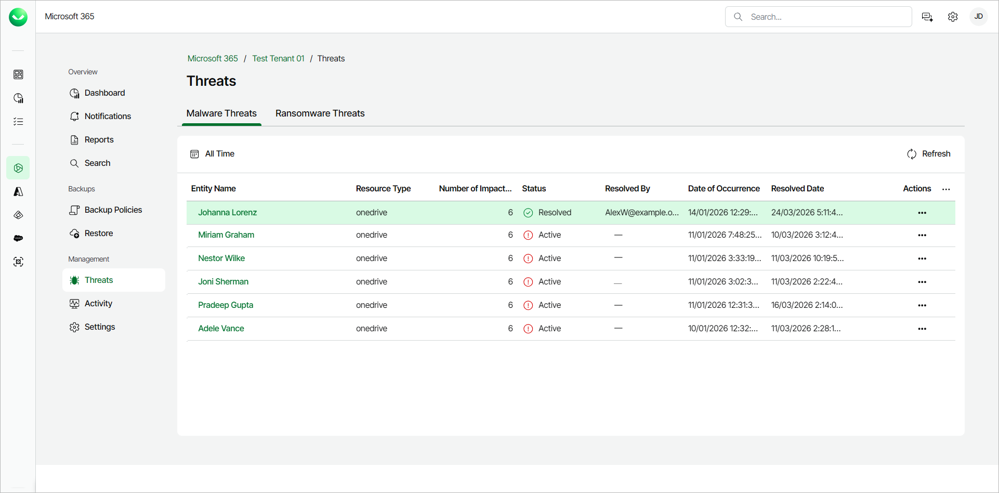
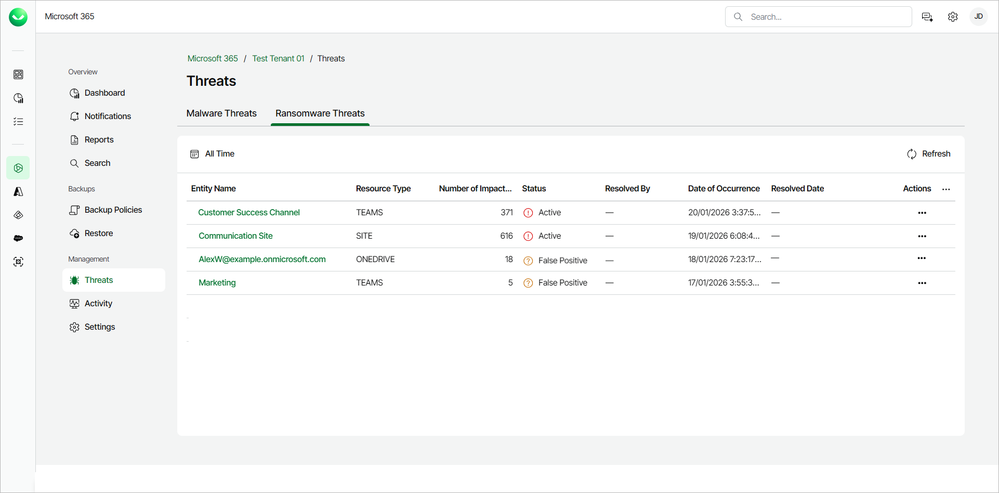
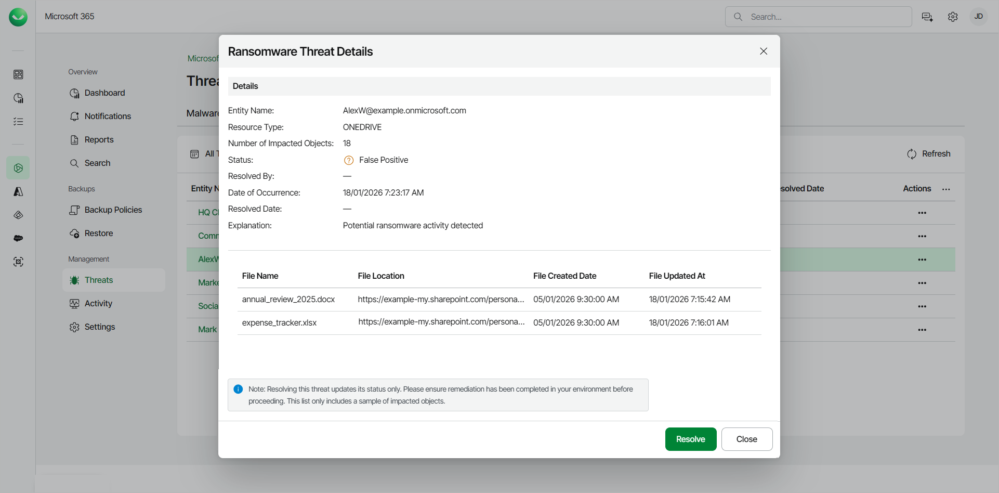
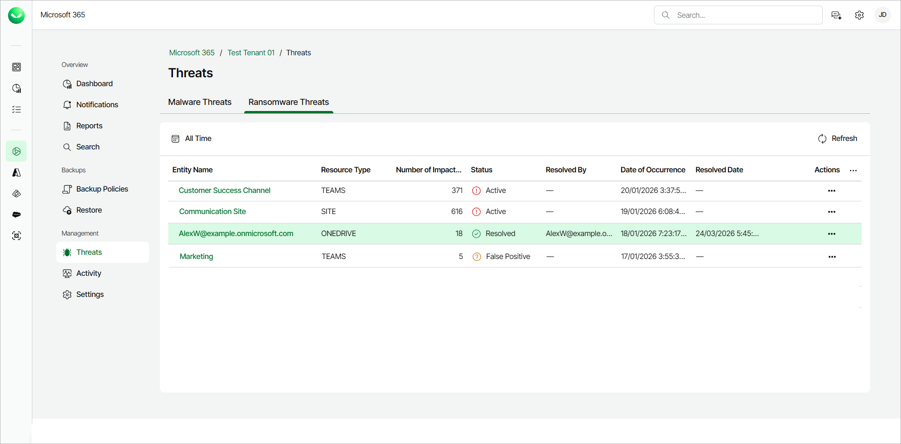

# Threats

Veeam Data Cloud for Microsoft 365 offers an advanced threat detection service. When a backup policy session completes, Veeam Data Cloud automatically analyzes the backed-up data for security threats and flags infected files as malware and suspicious encryption patterns as ransomware. Veeam Data Cloud does not scan file content directly. The advanced threat detection service analyzes file metadata and behavioral signals and performs machine learning analysis of backup statistics.

To resolve any threats that Veeam Data Cloud detects, you must take action in your customer environment.

Consider the following:

* The advanced threat detection service is available for customers of the Advanced and Premium plans.
* The advanced threat detection service must be explicitly enabled for the tenant. It is not active by default due to customer consent requirements for AI-powered features.
* The advanced threat detection service is available for Microsoft 365 tenants provisioned in the following backup storage regions:

* Australia East
* East US
* Germany West Central
* UK South
* West Europe
* West US 3

Working with Malware Threats

The advanced threat detection service in Veeam Data Cloud detects known malware signatures in your Microsoft OneDrive for Business, Microsoft SharePoint Online and Microsoft Teams backed-up data and flags them as malware threats.

To work with detected malware threats, do the following:

1. On the Microsoft 365 page, click the name of the tenant you want to manage.
2. Select Threats.
3. On the Malware Threats tab, Veeam Data Cloud displays the following information about detected malware threats:

* Entity Name. The name of the Microsoft 365 object where Veeam Data Cloud detected the infected files.
* Resource Type. The Microsoft 365 resource type (onedrive, site or teams) where Veeam Data Cloud found the threat.
* Number of Impacted Objects. The total number of flagged files.
* Status. The status of the detected threat. A detected threat can have one of the following statuses:

* Active. The detected threat is active and requires immediate attention in the customer environment.

* Resolved. The detected threat was mitigated in the customer environment and resolved in Veeam Data Cloud.

* Resolved By. The email address of the user who marked the detected threat as resolved.
* Date of Occurrence. The date and time of the backup policy session during which Veeam Data Cloud detected the infected files. This timestamp is not the date and time the malware was created. It is when Veeam Data Cloud detected the threat.
* Resolved Date. The date and time when the detected threat was resolved.
* Actions. The actions you can take about the threat. The available actions are the following:

* View Details. Click View Details to view further details about the detected threat.
* Resolve Threat. After you mitigate the detected threat in the customer environment, click Resolve Threat to change the status of the threat to Resolved.

1. Click the name in the Entity Name column or click View Details in the Actions column to view further details about the detected threat.
2. In the Malware Threat Details window, Veeam Data Cloud displays a summary of the details of the threat. You can also view the following information for each infected file:

* File Name. The name of the infected file.
* File Location. The location of the infected file.
* File Created Date. The date and time the file was created.
* File Updated At. The date and time the file was last modified.

1. After taking actions in your environment to resolve the detected threat, in Veeam Data Cloud, click Resolve to change the status of that threat to Resolved.

|  |
| --- |
| tip |
| You can click the calendar to filter the list of detected threats to a specific time period. You can also click Refresh to refresh the view with the latest information. |

Working with Ransomware Threats

The advanced threat detection service in Veeam Data Cloud detects suspicious encryption patterns, unusual file extension changes and entropy spikes deviating from the established baseline in your Microsoft OneDrive for Business, Microsoft SharePoint Online and Microsoft Teams data and flags them as ransomware threats.

To work with detected ransomware threats, do the following:

1. On the Microsoft 365 page, click the name of the tenant you want to manage.
2. Select Threats.
3. Go to the Ransomware Threats tab. Veeam Data Cloud displays the following information about detected ransomware threats:

* Entity Name. The name of the Microsoft 365 resource where Veeam Data Cloud detected the infected files.
* Resource Type. The Microsoft 365 resource type (ONEDRIVE, SITE or TEAMS) where Veeam Data Cloud found the threat.
* Number of Impacted Objects. The total number of flagged files.
* Status. The status of the detected threat. A detected threat can have one of the following statuses:

* Active. The detected threat is active and requires immediate attention in the customer environment.
* False Positive. Veeam Data Cloud determined that the detected threat is a false alarm and you can mark it as resolved in Veeam Data Cloud.
* Resolved. The detected threat was mitigated in the customer environment and resolved in Veeam Data Cloud.

* Resolved By. The email address of the user who marked the detected threat as resolved.
* Date of Occurrence. The date and time of the backup policy session during which Veeam Data Cloud detected the infected files. This timestamp is not the date and time the ransomware was created. It is when Veeam Data Cloud detected the threat.
* Actions. The actions you can take about the threat. The available actions are the following:

* View Details. Click View Details to view further details about the detected threat.
* Resolve Threat. After you mitigate the detected threat in the customer environment, click Resolve Threat to change the status of the threat to Resolved.

1. Click the name in the Entity Name column or click View Details in the Actions column to view further details about the detected threat.
2. In the Ransomware Threat Details window, Veeam Data Cloud displays a summary of the details of the threat. You can also view the name, location and date of creation for a sample of the infected files:

* File Name. The name of the infected file.
* File Location. The location of the infected file.
* File Created Date. The date and time the file was created.
* File Updated At. The date and time the file was last modified.

1. After taking actions in your environment to resolve the detected threat, in Veeam Data Cloud, click Resolve to change the status of that threat to Resolved.

|  |
| --- |
| tip |
| You can click the calendar to filter the list of detected threats to a specific time period. You can also click Refresh to refresh the view with the latest information. |

