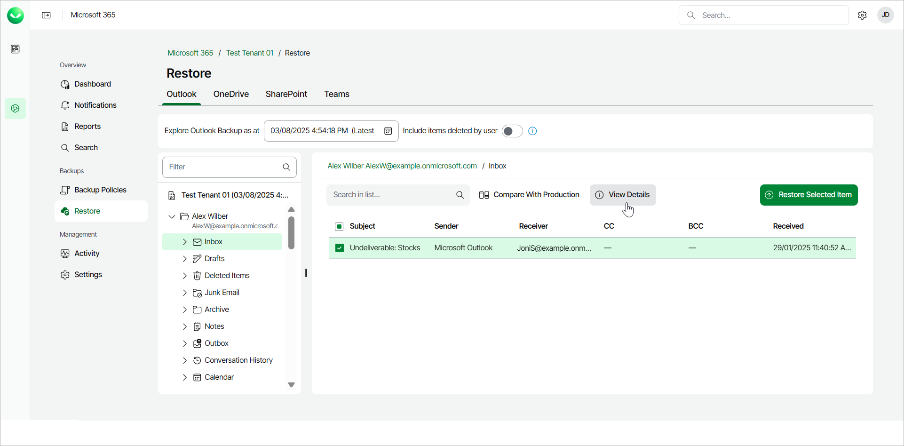
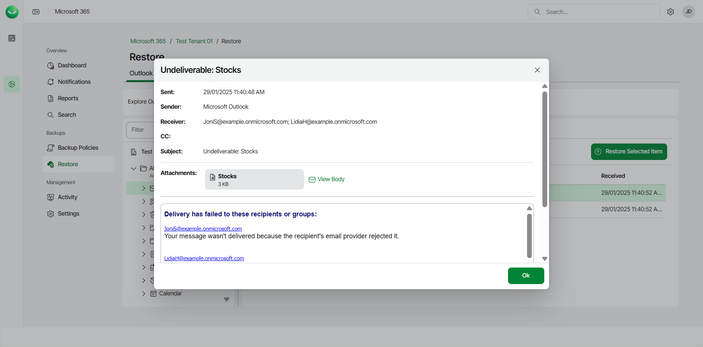

# Viewing Outlook Emails

To view a single email within a specific folder of a mailbox:

1. On the Microsoft 365 page, click the name of the tenant you want to manage.
2. Select Restore.
3. On the Outlook tab, expand the mailbox that contains the folder with the email you want to view.
4. Select the folder that contains the email you want to view.
5. Select the email you want to view and click View Details.

1. The email contents will open in a new window. Veeam Data Cloud displays the following information:

* Sent — date and time when the email was sent.
* Sender — sender of the email.
* Receiver — receiver of the email.
* CC — contacts to whom a copy of the email was sent.
* Subject — subject of the email.
* View Body — click to view the body of the email.

