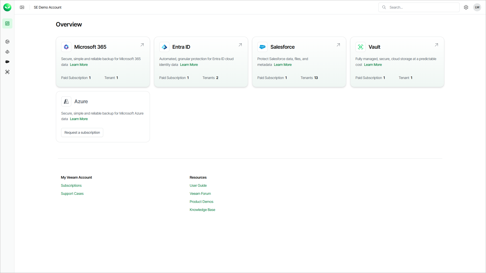

# Organization Overview

A Veeam Data Cloud organization incorporates your Veeam Data Cloud accounts and one or more subscriptions for the workloads you want to protect.

On the Overview page, you can find information about the protected workloads in your Veeam Data Cloud organization. To protect additional workloads, request a subscription for them. You can also request a subscription for Veeam Data Cloud Vault to integrate storage vaults with other Veeam solutions. To request a subscription, select Request a subscription next to the product you want to add.

The Overview page also provides links to Veeam resources where you can get support, manage your organization and subscriptions, and learn more about the Veeam Data Cloud platform.

Overview is the default landing page when you log in. To return to Overview from another page, select the Overview icon or the Veeam Data Cloud logo in the upper-left corner. For more information about logging in, see [Accessing Veeam Data Cloud](accessing_vdc.md).

