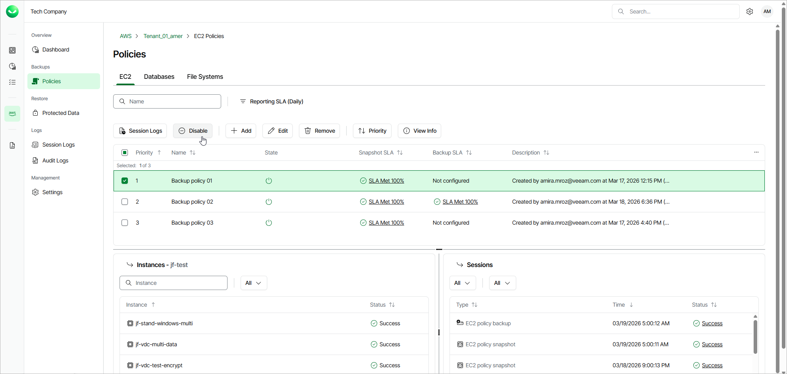

# Disabling and Enabling Policies

By default, Veeam Data Cloud for AWS runs all created backup policies according to the SLA templates assigned to the policy. However, you can temporarily disable a backup policy so that Veeam Data Cloud for AWS does not run the backup policy automatically.

To enable or disable a backup policy, do the following:

1. On the tenant administration page, navigate to Policies.
2. Switch to the necessary tab and select the backup policy.

1. Click Disable or Enable.

