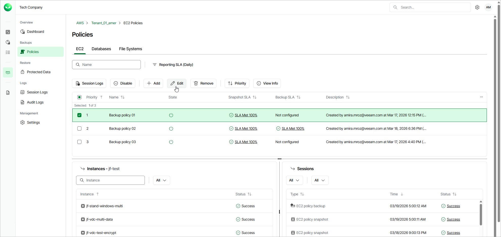

# Editing Policy Settings

For each backup policy, you can modify settings configured while creating the policy:

1. On the tenant administration page, navigate to Policies.
2. Switch to the necessary tab and select the backup policy whose settings you want to edit.

1. Click Edit. The Edit Policy wizard will open.

1. Edit backup policy settings as described in sections [Creating EC2 Backup Policies](aws_backup_create_ec2.md), [Creating RDS Backup Policies](aws_backup_create_rds.md), [Creating DynamoDB Backup Policies](aws_backup_create_dynamo.md), [Creating Redshift Clusters Backup Policies](aws_backup_create_redshift_clusters.md), [Creating Redshift Serverless Backup Policies](aws_backup_create_redshift_serverless.md), [Creating EFS Backup Policies](aws_backup_create_efs.md) or [Creating FSx Backup Policies](aws_backup_create_fsx.md).

