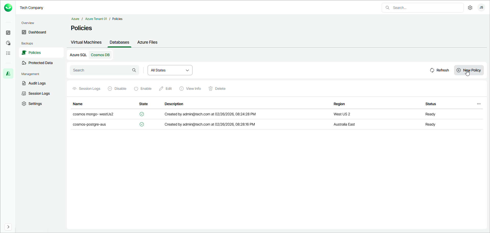

# Step 1. New Cosmos DB Policy Wizard

To launch the New Cosmos DB Policy wizard, do the following:

1. In the Backups section of the main menu, select Policies.
2. Select Databases > Cosmos DB and click New Policy.

