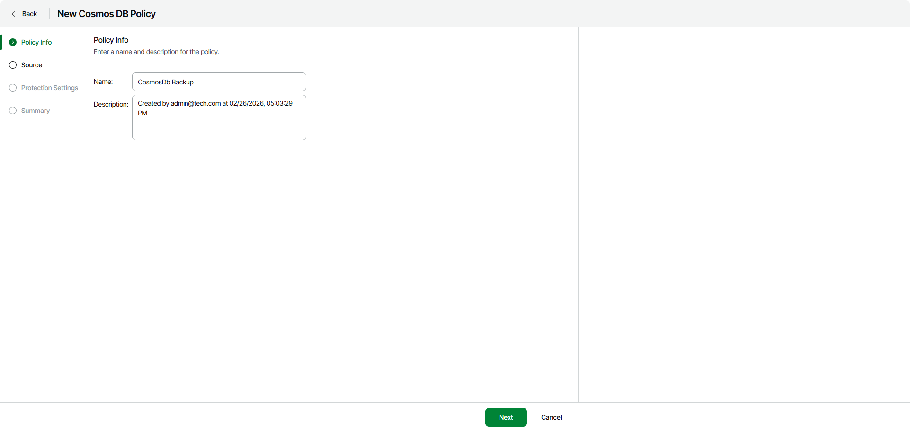

# Step 2. Specify Backup Policy Name

At the Policy Info step of the wizard, specify a name and description for the backup policy.

In the Description field, by default, Veeam Data Cloud for Microsoft Azure displays the current user and time stamp. You can edit the information in this field.

The maximum length of the name is 255 characters. The following characters are not supported: / \ " ' : | < > + = ; , ? ! \* % # ^ @ & $ .

