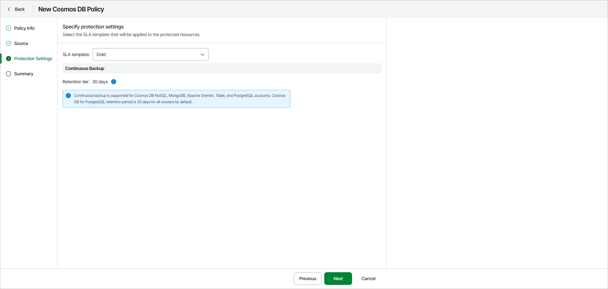

# Step 4. Specify Policy Protection Settings

At the Protection Settings step of the wizard, select an SLA template that will be applied to the protected resources.

When processing a Cosmos DB account added to a backup policy, Veeam Backup for Microsoft Azure uses continuous backup — a native Microsoft Azure capability that allows you to eliminate consumption of extra provisioned throughput without affecting the database performance and availability.

Every 8 hours, Veeam Data Cloud runs configuration sessions to check the continuous backup retention period defined in Microsoft Azure for all the Cosmos DB accounts added to the backup scope. If the retention period differs from the retention period specified in the backup policy settings, Veeam Data Cloud redefines the retention period in Microsoft Azure.

Every time Veeam Data Cloud synchronizes data between Microsoft Azure and the configuration database, it creates a database record for each Cosmos DB account added to a backup policy — the record can further be used to restore this account. For more information on how continuous backup is performed, see [Microsoft Docs](https://learn.microsoft.com/en-us/azure/cosmos-db/continuous-backup-restore-introduction).

You can select one of the following SLA templates:

* Gold — select this option if you want to retain the records for 30 days.
* Silver — select this option if you want to retain the records for 7 days.
* Bronze — select this option if you want to retain the records for 7 days.

|  |
| --- |
| Note |
| Regardless of the specified retention period for continuous backup, backups of Cosmos DB for PostgreSQL accounts are kept for 35 days. |

