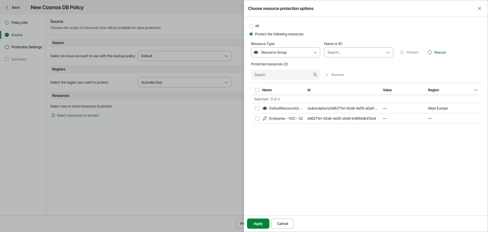

# Step 3. Configure Backup Source Settings

At the Source step of the wizard, specify an Azure account, region and resources to back up:

1. In the Source section, select the service account from the available accounts list. The specified service account must belong to the Microsoft Entra tenant that contains the Cosmos DB resources that you want to protect.
2. In the Regions section, specify a region whose resources you want to protect with the backup policy.
3. In the Resources section, click Select resources to protect and specify what resources you want to protect with the backup policy:

* Select All if you want to protect all resources available in the selected region. If you select this option, Veeam Data Cloud will regularly check for new Cosmos DB accounts created in the selected region and automatically update the backup policy settings to include these databases in the backup scope.

* Select Protect the following resources if you want to protect specific resources in the selected region and specify the resources explicitly.

1. [For the Protect the following resources option]

1. Use the Resource type drop-down list to select either of the following options:

* Subscription — to back up Cosmos DB accounts managed by specific subscriptions.

* Resource group — to back up Cosmos DB accounts that reside in a specific Azure resource group.

* Cosmos DB Account — to back up only specific Cosmos DB accounts.

|  |
| --- |
| Note |
| Cosmos DB accounts that have the Deleted status cannot be added to the backup scope. |

1. From the Name or ID drop-down list, select the necessary resource and click Protect to add the resource to the backup scope. Alternatively, start typing the name of the resource in the Search field and select the necessary resource.

After you define the backup scope, you can select the necessary resource and click Remove to remove the resource from the backup scope.

|  |
| --- |
| tip |
| Resources are synchronized every 24 hours. If you do not see recently added resources in the list, click Rescan to force synchronization. |

1. To save changes made to the backup policy settings, click Apply.

