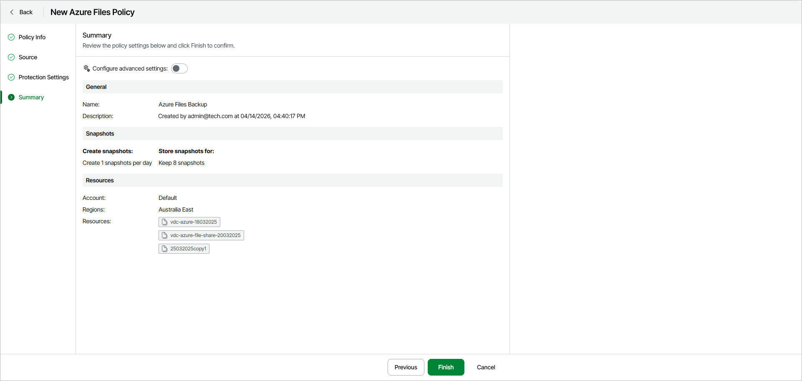
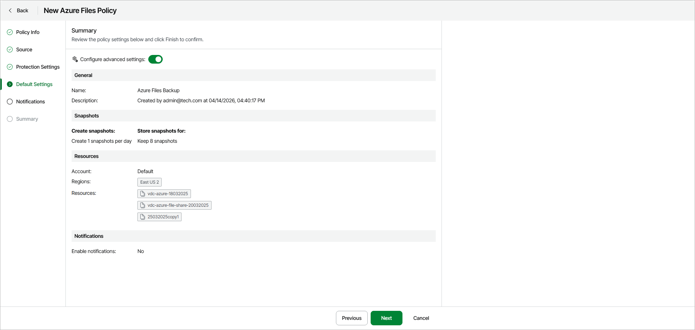

# Step 5. Review Default Policy Settings

At the Summary step of the wizard, do either of the following:

* To complete the backup policy configuration using the default settings, click Finish .

* To configure additional settings for the policy, turn on the Configure advanced settings toggle — in this case, the step name will change to Default Settings — and click Next.

