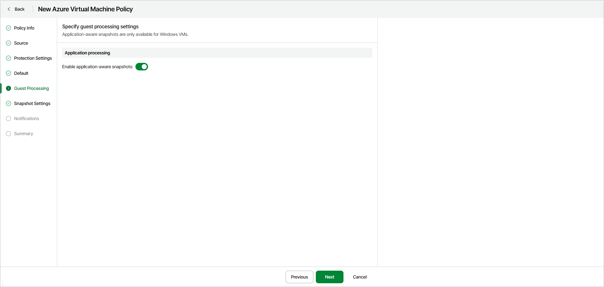

# Step 6. Specify Guest Processing Settings

The Guest Processing step of the wizard is available if you have enabled the advanced settings configuration at the [Summary](azure_backup_create_vm_review.md) step of the wizard.

If a VM is turned off at the time of backup, the consistency of snapshot is implied. But if a VM is turned on during backup, and applications are running in the guest OS, a consistent snapshot is not guaranteed. For backup of Windows-based VMs, you can enable application-aware processing to create a consistent snapshot even when a processed VM is running.

Application-aware processing is a Veeam technology that is based on Volume Shadow Copy Service (VSS). VSS is a Microsoft solution that allows for quiescing applications on Azure VMs and creating consistent snapshots of application data. You can enable application-aware processing for Windows-based Azure VMs running VSS-aware applications to ensure that the applications can recover successfully and without data loss. For more information on VSS, see [Microsoft Docs](https://learn.microsoft.com/en-us/previous-versions/windows/it-pro/windows-server-2003/cc785914%28v%3Dws.10%29).

Port Requirements and Recommendations

When creating transactionally consistent backups, Veeam Data Cloud for Microsoft Azure uses the Azure Storage service to stop and start applications running on the processed Windows-based Azure VMs. To ensure proper processing, Windows-based Azure VMs for which you plan to enable application-aware processing must have outbound network port 443 open.

To allow outbound access from VM to Azure Storage service, we recommend using a [virtual network service tag](https://learn.microsoft.com/en-us/azure/virtual-network/service-tags-overview). The tag for the Azure Storage service is Storage. If you want to use an IP address range assigned to Azure storage, you can download a .JSON file with the full list of Azure IP ranges and service tags for the global Azure storage and specific Azure regions from the [Microsoft Download Center](https://www.microsoft.com/en-us/download/confirmation.aspx?id=56519).

Considerations and Limitations

* To enable application-aware processing, Veeam Data Cloud for Microsoft Azure installs VSS agents on source Azure VMs by running a specific PowerShell script. That is why if you use PowerShell execution policies to control how PowerShell loads configuration files and runs scripts on the source VMs, make sure that the LocalMachine scope is set to RemoteSigned. Otherwise, Veeam Data Cloud for Microsoft Azure will not be able to run the script and application-aware processing will fail.
* While creating application-aware snapshots, VSS Guest Agent uses VSS Copy Backup to create snapshots of the processed Azure VMs during the backup policy session. VSS Copy Backup does not support truncation of transaction logs. For more information on VSS Backup types, see [Microsoft Docs](https://learn.microsoft.com/en-us/windows/win32/vss/vss-backup-state).

To enable application-aware processing, turn on the Enable application-aware snapshots toggle.

