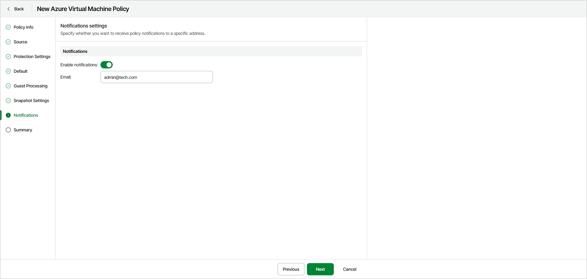

# Step 8. Specify Notifications Settings

The Notifications step of the wizard is available if you enabled advanced settings configuration at the [Summary](azure_backup_create_vm_review.md) step of the wizard.

To configure notifications about policy completion results, do the following:

1. Turn on the Enable notifications toggle.
2. In the Emails field, specify one or more email addresses. If you specify multiple email addresses, you must separate them with semicolons.

Notifications include the policy name, execution date and time and completion status — Success, Warning or Error.

