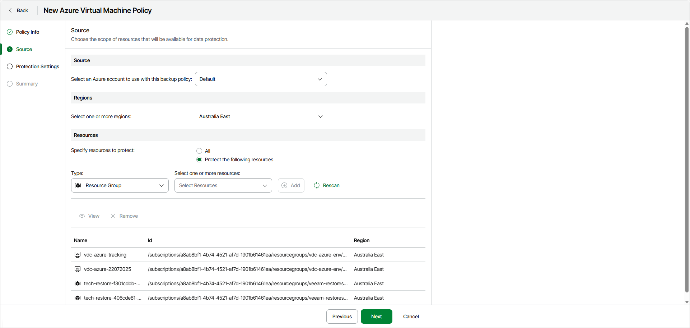

# Step 3. Specify Policy Source

At the Source step of the wizard, specify an Azure account, region and resources to back up:

1. In the Source section, specify an Azure account that has access to Azure resources that you want to protect with the backup policy.
2. In the Regions section, select regions whose resources you want to protect with the backup policy.
3. In the Resources section, specify virtual machines that you want to protect with the backup policy:

* Select All if you want to protect all virtual machines in the selected region.
* Select Protect the following resources if you want to protect specific virtual machines in the selected region.

1. [For the Protect the following resources option] Specify the following:

1. From the Type drop-down list, choose a selection criteria for the virtual machines that you want to protect. You can select the following options:

* Virtual machines — select this option if you want to protect specific virtual machines.
* Resource Group — select this option if you want to protect all virtual machines from specific resource groups.
* Tag — select this option if you want to protect virtual machines with specific tags.

1. From the Select one or more resources drop-down list, select resources that you want to protect. Click Add.

Repeat steps a and b for each virtual machine or group of virtual machines that you want to add to the backup scope.

After you define the backup scope, you can select a resource and perform the following actions:

* Click View to display the detailed resource information.
* Click Remove to remove the resource from the backup scope.

