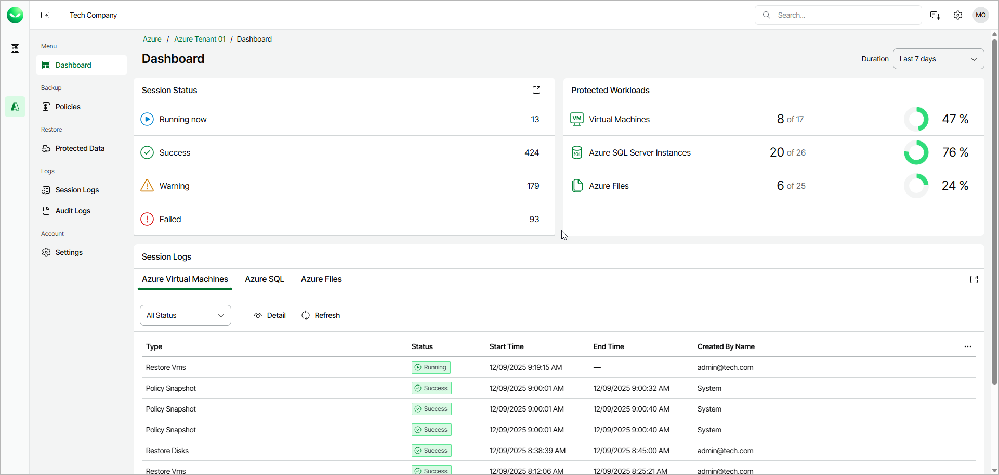

# Viewing Dashboard

The Veeam Data Cloud for Microsoft Azure dashboard provides information on the state of backup and restore sessions and protected Microsoft Azure resources.

The Dashboard page displays the following widgets:

* The Session Status widget displays the number of all sessions that completed successfully during a specific time period, the number of sessions that completed with warnings, the number of sessions that failed, and the number of sessions that are currently running.
* The Protected Workloads widget displays the number of Azure resources that got protected by Veeam Data Cloud for Microsoft Azure during a specific time period.

To get more information on specific protected resources, click the required widget row. To learn more, see [Microsoft Azure Restore](azure_restore.md).

* The Session Logs widget provides information on the last 10 Veeam Data Cloud for Microsoft Azure sessions, their type, status, start and end time and user who started the session.

By default, sessions in all statuses are shown. To view sessions in the necessary status only, click the icon in the upper right corner of the widget to open the Session Logs tab. To learn more, see [Viewing Logs](azure_logs.md).

By default, Veeam Data Cloud for Microsoft Azure displays information for the last 7 days. To specify another time period, select a period from the Duration drop-down list.

