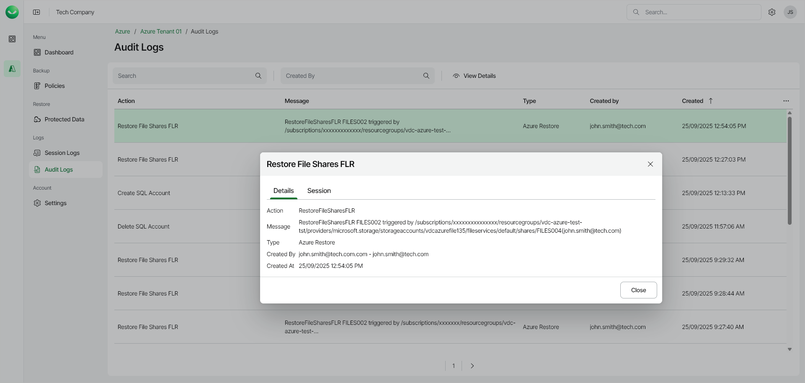

# Viewing Audit Logs

To view the list of all user actions, open the Audit Logs page in the Management section of the main menu. To view user action details, right-click a selected action and choose View Details.

