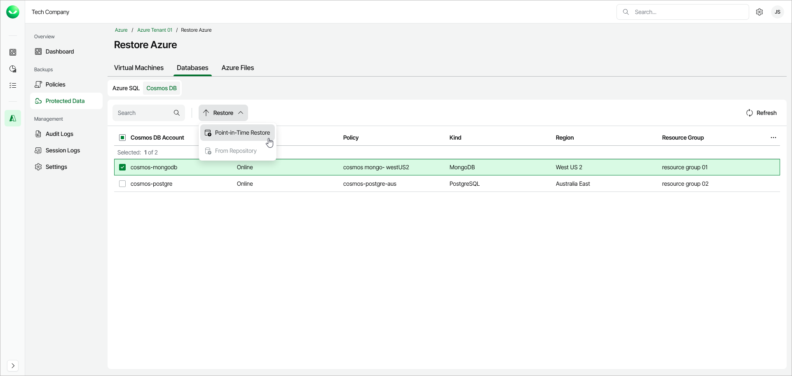

# Step 1. Launch Cosmos DB Restore Wizard

To launch the Cosmos DB Restore wizard, do the following:

1. In the Backups section of the main menu, select Protected Data.
2. Navigate to Databases > Cosmos DB.
3. Select the Cosmos DB account that you want to restore.
4. Click Restore > Point-in-Time Restore. Alternately, right-click the selected Cosmos DB account and, in the context menu, choose Restore > Point-in-Time Restore.

