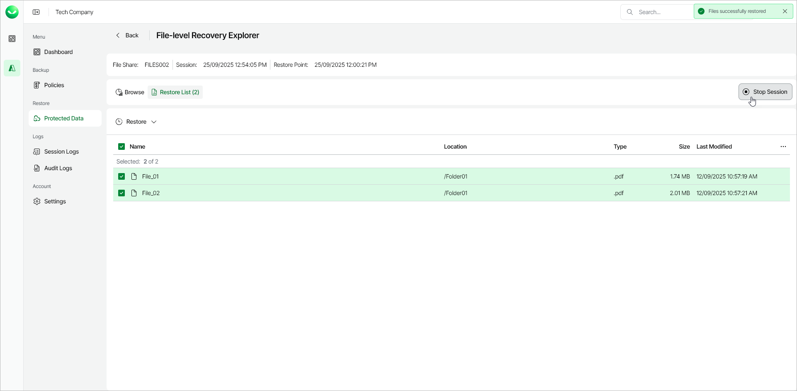

# Step 6. Complete Restore Session

After you finish working with the File-Level Recovery Explorer, it is recommended that you stop the restore session.

|  |
| --- |
| Tip |
| If you do not perform any actions in the File-Level Recovery Explorer for 30 minutes, and if no files are being restored, Veeam Data Cloud for Microsoft Azure will stop the recovery session automatically. |

To stop the restore session, do one of the following:

* On the File-level Recovery Explorer page, click Stop Session. Veeam Data Cloud will stop the mount session and return to the page with the list of protected file shares.

* In the Restore section of the main menu, navigate to Restore Azure > Azure Files and do the following:

* Locate the Azure file share whose files you are restoring and, in the File-level Recovery column, click the File-level Recovery link.
* In the File-level Recovery window, click Stop Session.

