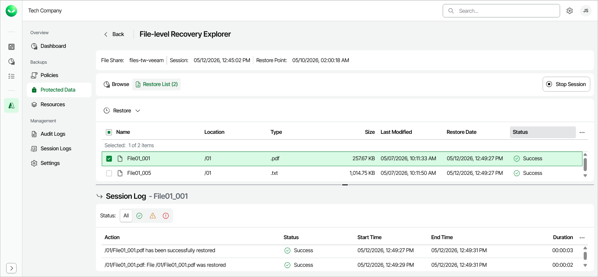
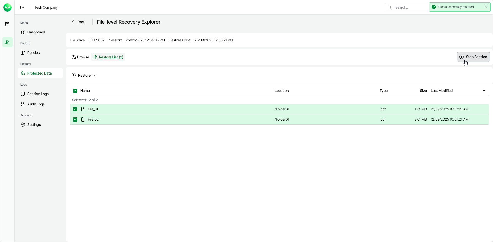
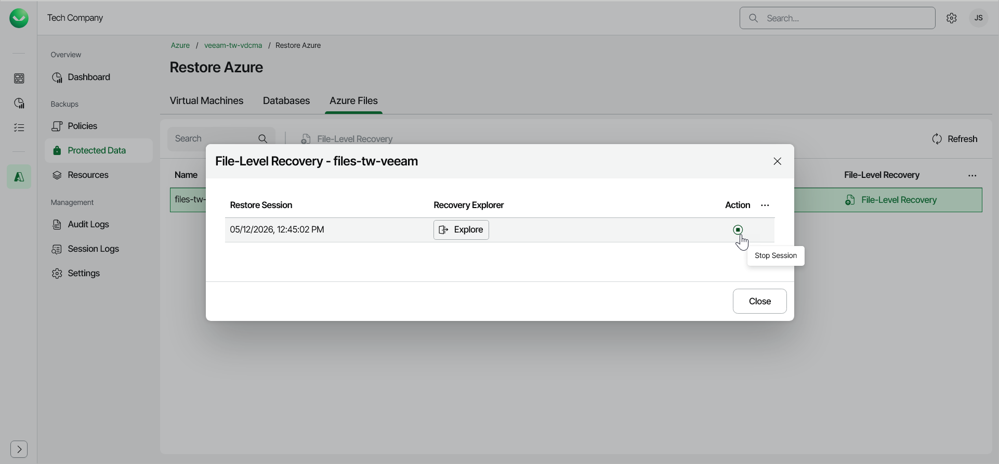

# Step 6. Review and Stop Restore Session

After restoring the necessary files and folders, you can review restore session information for each specific item and stop the restore session.

To view an item's restore log, select the item in the Restore List. Details of the restore operation are displayed in the Session Log section at the bottom of the page.

After you finish working with the File-Level Recovery Explorer, it is recommended that you stop the restore session.

|  |
| --- |
| Tip |
| If you do not perform any actions in the File-Level Recovery Explorer for 30 minutes and if no files are being restored, Veeam Data Cloud for Microsoft Azure will stop the recovery session automatically. |

To stop the restore session, do one of the following:

* In the File-level Recovery Explorer, click Stop Session. Veeam Data Cloud for Microsoft Azure will stop the mount session and return you to the page with the list of protected file shares.

* Navigate to the Protected Data > Azure Files and do the following:

* Locate the Azure file share whose files you are restoring and, in the File-Level Recovery column, click the File-Level Recovery link.
* In the File-Level Recovery window, click Stop Session.

