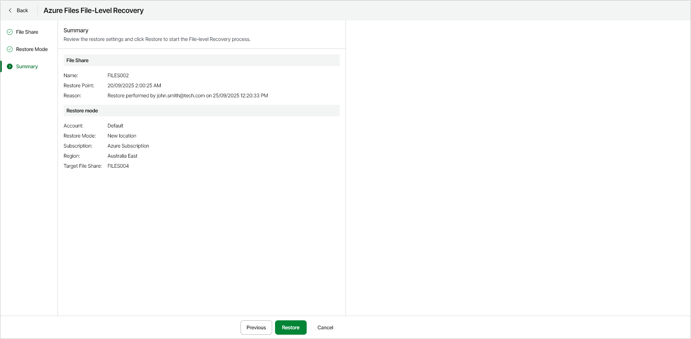
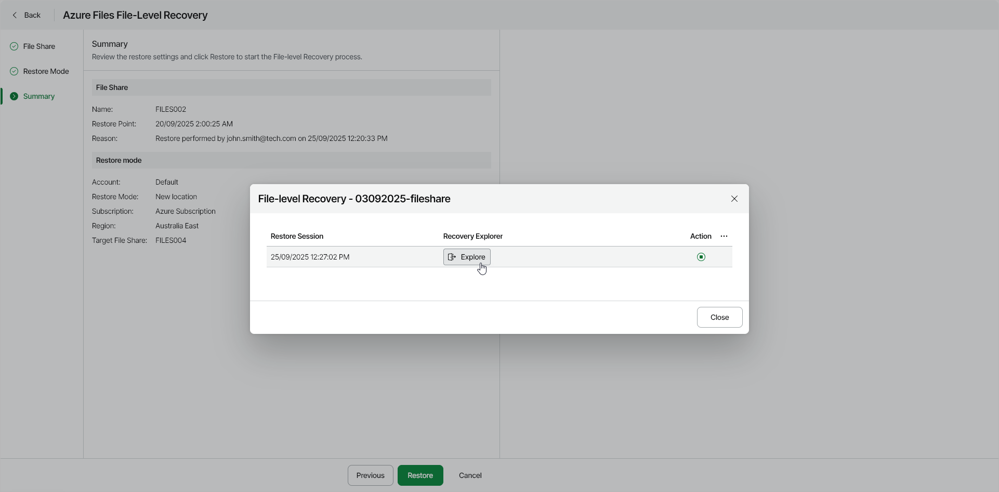

# Step 4. Start Restore Session

At the Summary step of the wizard, review summary information and start the restore session.

1. Click Restore.

Veeam Data Cloud for Microsoft Azure will start a restore session. During the restore session, Veeam Data Cloud for Microsoft Azure will launch a worker instance and attach virtual disks of the processed Azure VM to it. After the restore point is mounted and ready for browsing, Veeam Data Cloud for Microsoft Azure will generate a link to the File-Level Recovery Explorer.

You can stop the running session any time by clicking the Stop session icon in the File-level Recovery window.

1. In the File-level Recovery window, click Explore.

