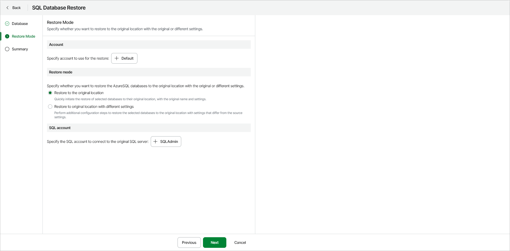

# Step 3. Specify Account and Restore Mode

At the Restore Mode step of the wizard, specify the following restore settings:

* [Azure account](#account)
* [Restore mode and destination](#mode)

Specifying Azure Account

Make sure the Default Azure account is selected. This is the Veeam service principal account that was created by Veeam Data Cloud for Microsoft Azure. This account has all the necessary roles and permissions for the restore operation.

Specifying Restore Mode and Destination

In the Restore mode section, select one of the following options:

* Restore to the original location — select this option to restore an Azure SQL database with the original name and settings. If you choose this option, you must also specify an Azure SQL account that will be used to access the restored database. To do this, in the SQL Account section, click Select account and choose the necessary SQL account.
* Restore to original location with different settings — select this option to restore an Azure SQL database with a different name or settings. If you choose this option, the SQL Database Restore wizard will display an additional step - [Settings](azure_restore_sql_settings.md). At this step, you can specify new settings for the restored VM.

