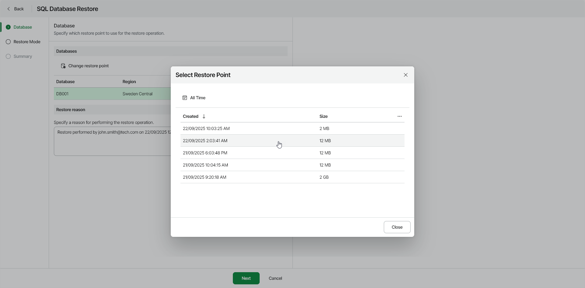

# Step 2. Select Restore Point

At the Databases step of the wizard, select a restore point that will be used to restore the selected Azure SQL database, as well as a reason for restore.

By default, Veeam Data Cloud for Microsoft Azure uses the most recent valid restore point. However, you can restore the Azure SQL data to an earlier state.

To select a specific restore point, do the following:

1. In the Databases section, select an Azure SQL database and click Change Restore Point.
2. In the Select Restore Point window, select the necessary restore point.

|  |
| --- |
| Note |
| If you restore multiple Azure SQL databases at once, you can specify a restore point for each database that you want to restore. |

|  |
| --- |
| Tip |
| You can filter the list of restore points by selecting the backup date range or destination. |

1. In the Restore reason field, by default, Veeam Data Cloud for Microsoft Azure displays the current user and time stamp.

You can edit the information in this field. This information will be saved to the session history, and you will be able to reference it later.

