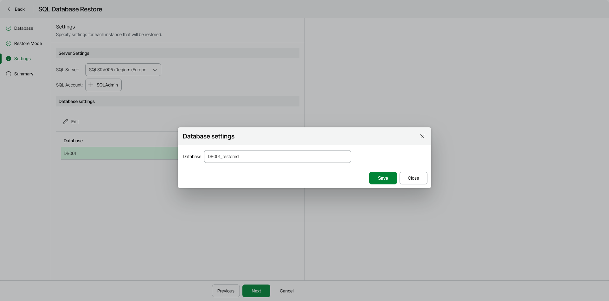

# Step 4. Specify Restore Settings

At the Settings step of the wizard, you can specify the following:

* [Settings for the SQL Server that will host the restored database](#restore)

|  |
| --- |
| Note |
| If you restore multiple databases, the SQL Server settings you specify will apply to all databases in the restore scope. |

* [New names for the restored databases](#rename)

Specifying SQL Server Settings

To specify settings for the target SQL Server that will host the restored database, do the following:

1. From the SQL Server list, select a target SQL server.

|  |
| --- |
| Note |
| The target SQL Server must belong to the same region as the restored database. |

1. Click Select SQL Account and in the Select SQL Account window, choose an account that will be used to authenticate against the target SQL Server.

Renaming Restored Databases

To specify a new name for each Azure SQL database you want to restore, do the following:

1. In the Database Settings section, select a database and click Edit.
2. In the Database Settings window, in the Instance field, specify a new name for the database.
3. After you specify a new name for the restored Azure SQL database, click Save.

