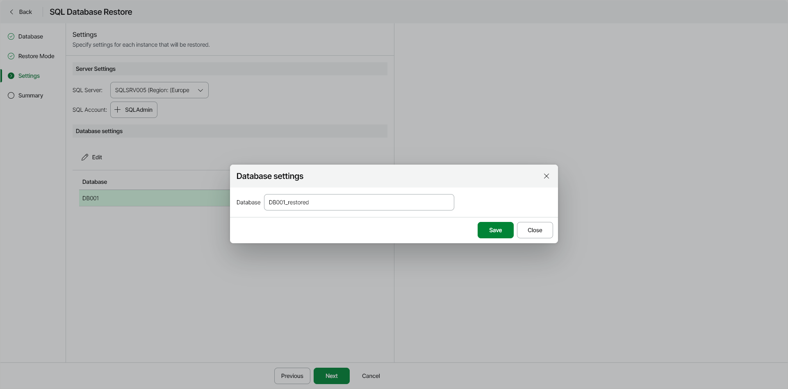

# Step 4. Specify Restore Settings

At the Settings step of the wizard, you can specify the following:

* [SQL Server Account or Entra ID Application that Veeam Data Cloud for Microsoft Azure will use to perform the restore operation](#auth)
* [Settings for the SQL Server that will host the restored database](#restore)

|  |
| --- |
| Note |
| If you restore multiple databases, the SQL Server settings you specify will apply to all databases in the restore scope. |

* [New names for the restored databases](#rename)

|  |
| --- |
| Note |
| The Server Settings and Database Settings sections are available only if you select to restore to a new location. |

Specifying Authentication Method

To specify the authentication method to connect to the SQL server, in the SQL Authentication section, select one of the following options:

* Entra ID Application — select this option to use an Entra ID application.

To enable Microsoft Entra ID authentication, the Azure SQL Server must have the [Veeam service account](azure_settings_accounts_service_view.md) application ID configured as its Entra ID administrator. You can set the Entra ID administrator in the settings of the Azure SQL Server in the Azure portal. To learn more, see [Microsoft documentation](https://learn.microsoft.com/en-us/azure/azure-sql/database/authentication-aad-configure?view=azuresql&tabs=azure-portal).

* Username and Password — select this option to use an Azuse SQL account. In the SQL Account section, click Select account and choose the necessary SQL account.

Specifying SQL Server Settings

To specify settings for the target SQL Server that will host the restored database, do the following:

1. In the Server Settings section, from the Region list, select the region of the target SQL server.
2. From the SQL Server list, select the target SQL server that will host the restored database.
3. From the Elastic Pool drop-down list, select an elastic pool to which the restored database will be added.

Renaming Restored Databases

To specify a new name for each Azure SQL database you want to restore, do the following:

1. In the Database Settings section, select a database and click Edit.
2. In the Database Settings window, in the Instance field, specify a new name for the database.
3. After you specify a new name for the restored Azure SQL database, click Save.

