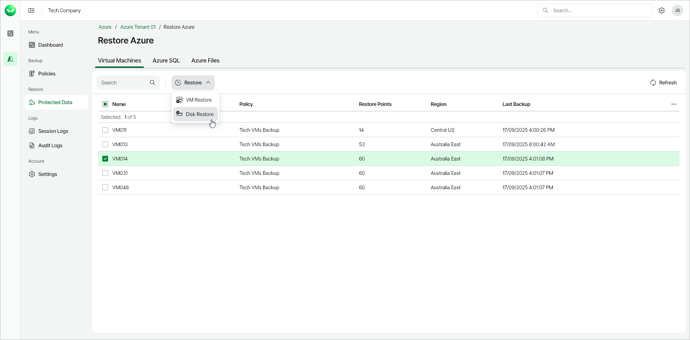

# Step 1. Launch Restore Virtual Machine Disks Wizard

To launch the Restore Virtual Machine Disks wizard, do the following:

1. In the Backups section of the main menu, select Protected Data.
2. On the Virtual Machines tab, select the Azure VM whose disks you want to restore.

|  |
| --- |
| Note |
| You can restore disks of only one Azure VM within a single restore session. |

|  |
| --- |
| Tip |
| You can also launch the Restore Virtual Machine Disks wizard with a preselected restore point. To do this, click the link in the Restore Points column, then in the Available Restore Points window, select a restore point. |

1. Click Restore > Disk Restore. Alternatively, right-click the selected VM and, in the context menu, choose Restore > Disk Restore.

