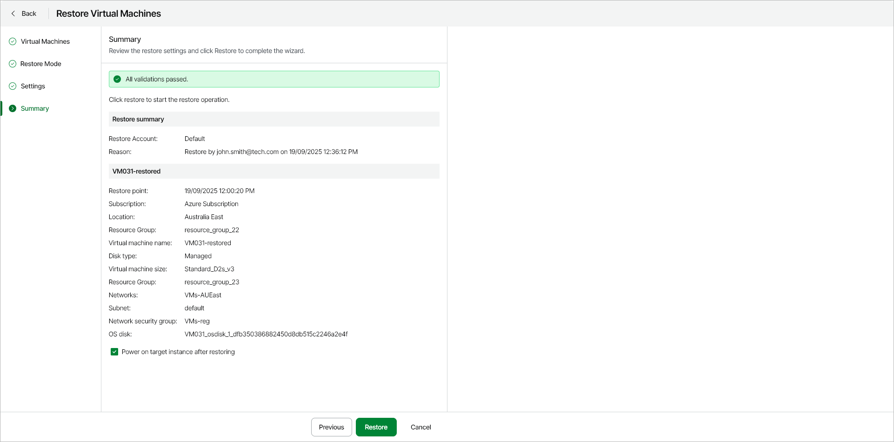

# Step 5. Complete Restore Process

At the Summary step of the wizard, review the summary information and click Restore.

|  |
| --- |
| Tip |
| If you want to start the restored Azure VM as soon as the restore process completes, select the Power on target instance after restoring check box. |

