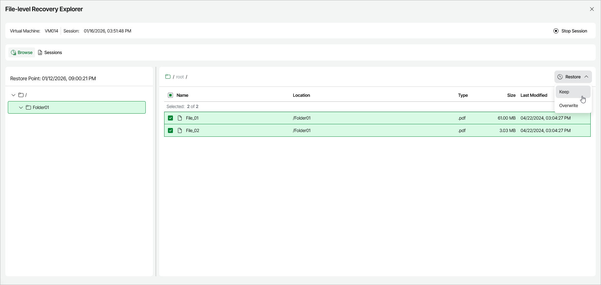

# Step 4. Select Files to Restore

In the File-Level Recovery Explorer, you can browse or search for files and folders, and restore them to their original location or to a new location on the Azure VM.

To restore files and folders, do the following:

1. Locate the items you want to restore. To do this, you can use one of the following options:

* Browse — This is the default view of the File-Level Recovery Explorer. In the navigation tree, open the folder that contains the items you want to restore.

|  |
| --- |
| Note |
| During file-level recovery from Linux-based Azure VMs, all files and folders are structured according to their physical location. That is why the file system tree displayed in the File-Level Recovery Explorer may differ from the logical file system tree of the processed Azure VM. |

* Search — On the Search tab, enter the full or partial name of an item and its location, then press Search to locate items.

1. Select the check box next to each item that you want to restore.
2. To restore the selected items, click Restore and choose one of the available restore options:

* To save the restored copies of the selected files and folders to the original location, click Restore > Keep original files.

If files and folders with the same names exist in the original location, Veeam Data Cloud for Microsoft Azure will save the selected files to this file share using the following naming format: <file\_name>\_RESTORED\_<date>\_<time>. Otherwise, Veeam Data Cloud for Microsoft Azure will save the selected files with their original names.

* To overwrite the files and folders in the original location, click Restore > Overwrite original files.

If files and folders with the same names already exist in the original location, Veeam Data Cloud for Microsoft Azure will overwrite these files. Otherwise, Veeam Data Cloud for Microsoft Azure will save the selected files with the names from the backup.

|  |
| --- |
| Note |
| If the folder that contains the restored items was deleted in the original location, Veeam Data Cloud for Microsoft Azure will prompt you to provide a new path for saving the restored items. |

* To save the restored files and folders to a new location on the VM, click Restore > To a new location.

When you select this restore option, Veeam Data Cloud for Microsoft Azure prompts you to specify the path to a new location on the VM. In the Restore To New Location dialog window, enter the path and click Restore.

|  |
| --- |
| Important |
| You cannot specify the path to the original location, or to a subfolder within the original location, as the new location for the restored items. |

