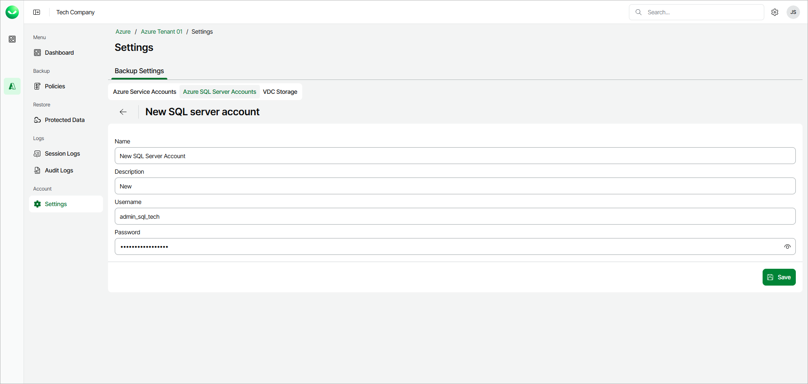

# Adding Database Account

To add a new database account, do the following:

1. In the Account section of the main menu, select Settings.
2. Select the Azure SQL Server Accounts tab and click Create.
3. In the Name field, enter a name for the account.

The maximum length of the account name is 32 characters. The following characters are supported: Latin letters, numeric characters, underscores and dashes. The following characters are not supported: \ / " ' [ ] : | < > + = ; , ? \* @ & $.

1. In the Description field, enter a description of the account for future reference.
2. In the Username field, enter a user account that will be used to connect to SQL server.
3. In the Password field, enter the password for the user account that will be used to connect to SQL server.

|  |
| --- |
| Important |
| When you add a new database account, consider the following:   * The specified credentials must belong to a user account that has the following roles assigned: The ##MS\_DatabaseManager##, ##MS\_LoginManager##, ##MS\_DatabaseConnector## and ##MS\_DefinitionReader## server-level roles, and the db\_owner database-level role. Consider that the db\_owner database-level role is required for backup operations only. For more information on [server-level roles](https://learn.microsoft.com/en-us/sql/relational-databases/security/authentication-access/server-level-roles?view=sql-server-ver16) and [database-level roles](https://learn.microsoft.com/en-us/sql/relational-databases/security/authentication-access/database-level-roles?view=sql-server-ver16), see Microsoft Docs. * Microsoft Entra ID authentication is not supported. |

