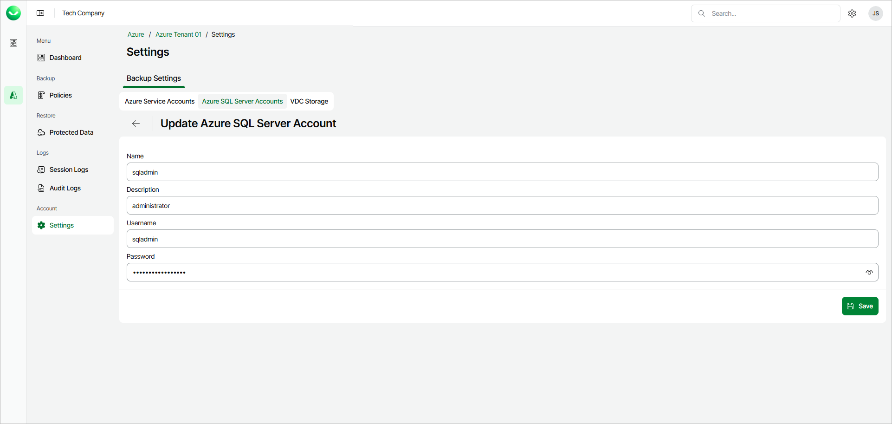

# Editing SQL Server Account

To edit settings of an existing SQL Server account, do the following:

1. In the Management section of the main menu, select Settings.
2. On the Azure SQL Server Accounts tab, select the account you want to edit and click Edit. Veeam Data Cloud for Microsoft Azure will display the account settings for editing.
3. Edit the account settings as needed and click Update.

