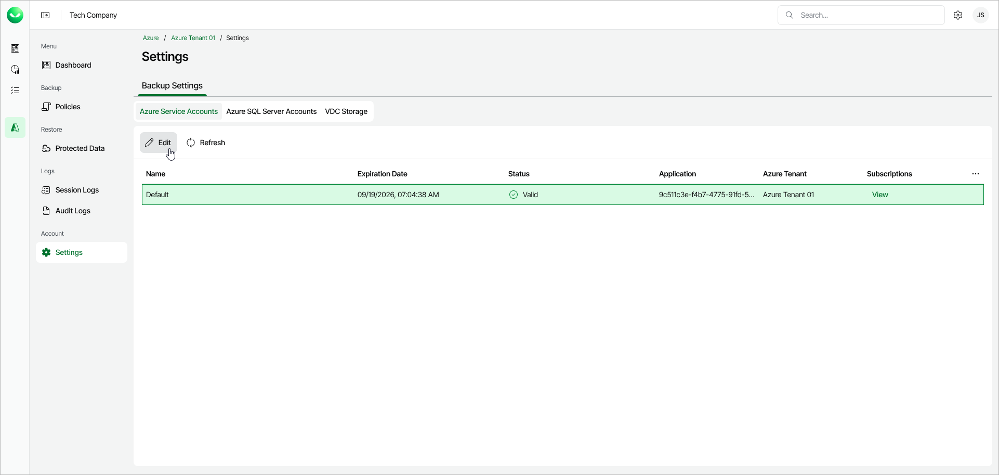
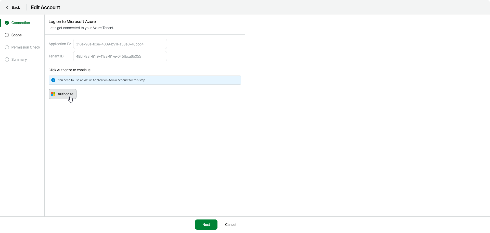
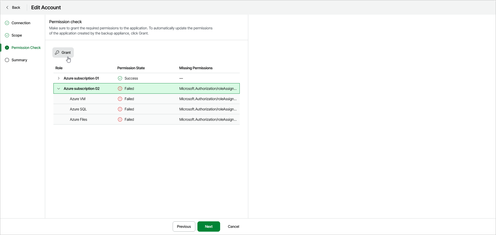
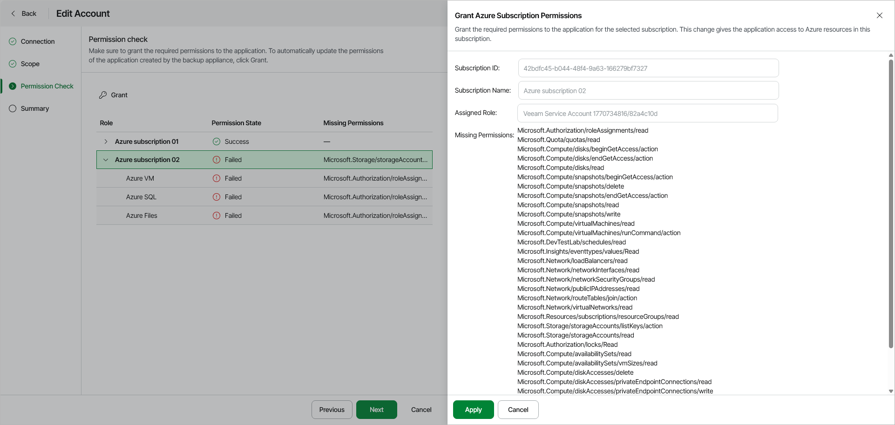

# Editing Azure Service Accounts

You can allow Veeam Data Cloud for Microsoft Azure to access additional subscriptions in your Azure tenant to protect their resources. To do this, perform the following steps:

1. On the Azure Service Accounts tab, select a service account and click Edit.

Veeam Data Cloud for Microsoft Azure will launch the Edit Account wizard.

1. At the Connection step of the wizard, you must allow Veeam Data Cloud for Microsoft Azure to access your Azure tenant. To do this, click Authorize and log in to your Microsoft account.

Make sure to use the credentials of a user account that has the Application Administrator role. For more information about this role, see [Microsoft documentation](https://learn.microsoft.com/en-us/entra/identity/role-based-access-control/permissions-reference#application-administrator).

|  |
| --- |
| Important |
| To add a subscription to the Veeam Data Cloud protection scope, the account you use for authorization also must have the following permissions at the subscription level:   * Microsoft.Authorization/roleDefinitions/write * Microsoft.Authorization/roleAssignments/write * Microsoft.Resources/subscriptions/resourceGroups/read   For more information about permissions in Azure, see [Microsoft documentation](https://learn.microsoft.com/en-us/azure/role-based-access-control/resource-provider-operations). |

1. At the Scope step of the wizard, to add a subscription whose resources Veeam Data Cloud for Microsoft Azure will protect, do the following:

1. In the Subscriptions to protect field, click the subscriptions link.
2. In the Subscriptions window, select the subscription that you would like to add to the protection scope, and click Apply.

1. At the Permission Check step of the wizard, ensure that Veeam Data Cloud for Microsoft Azure has all necessary permissions to protect the subscription resources. To do this, perform the following steps:

1. Select the subscription for which you want to grant the missing permissions to Veeam Data Cloud, and click Grant.

1. In the Grant Azure Subscription Permissions window, review the required permissions and click Apply.

1. At the Summary step of the wizard, review the updated status of the tenant's subscriptions, and click Finish.

