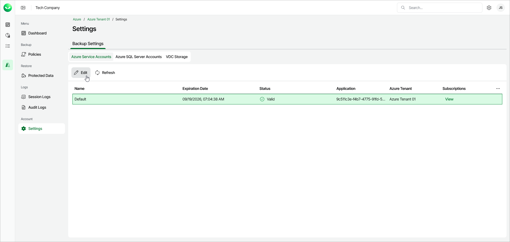
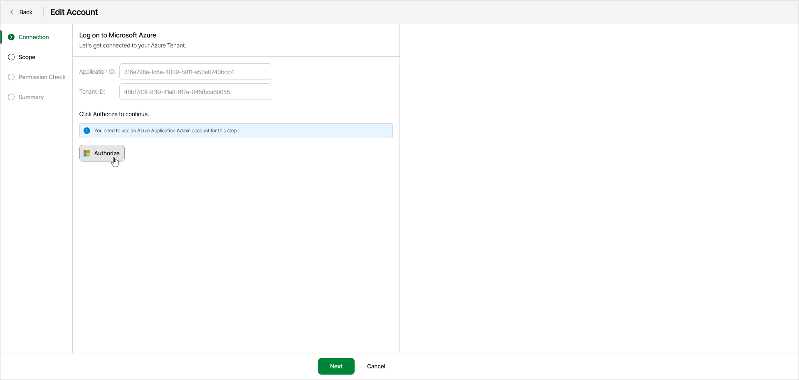
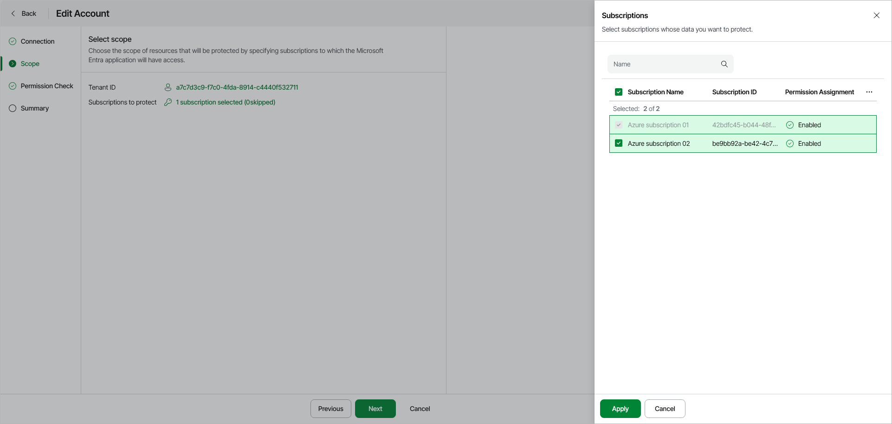
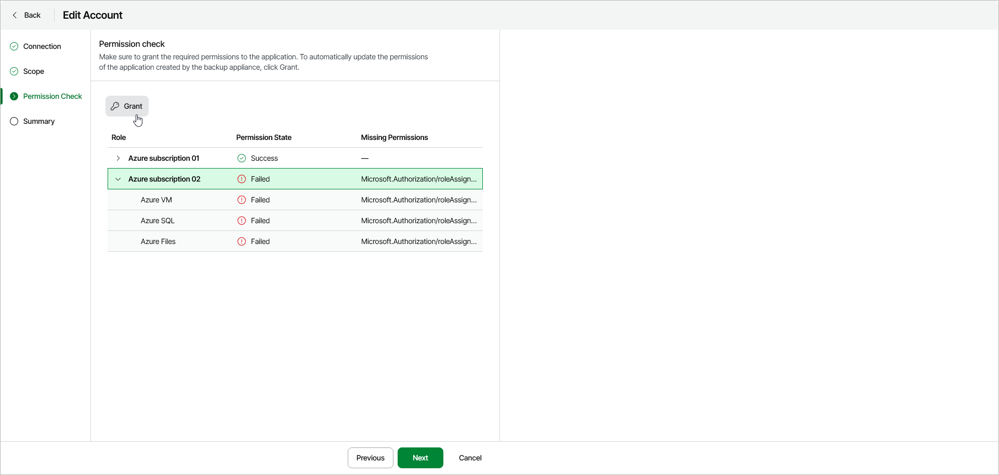
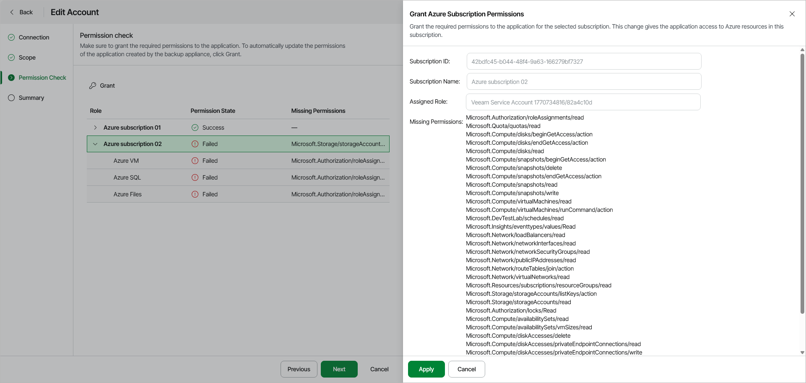
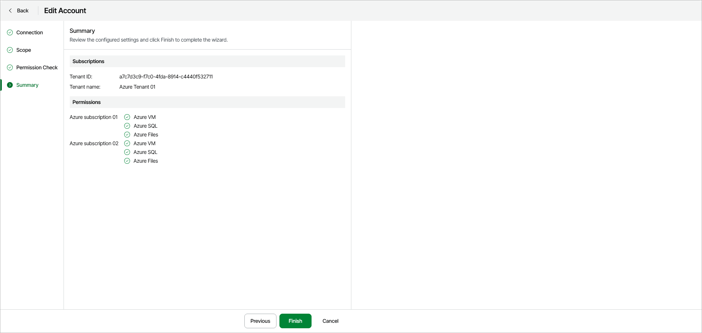

# Editing Azure Service Accounts

You can edit the Azure service account settings to:

* Allow Veeam Data Cloud for Microsoft Azure to access additional subscriptions in your Azure tenant and protect their resources.
* Update Veeam service account permissions if they become outdated — for example, when a newly introduced feature requires additional permissions.

To edit the Azure service account settings, perform the following steps:

1. On the Azure Service Accounts tab, select the service account you want to update and click Edit.

Veeam Data Cloud for Microsoft Azure will launch the Edit Account wizard.

1. At the Connection step of the wizard, you must allow Veeam Data Cloud for Microsoft Azure to access your Azure tenant. To do this, click Authorize and log in to your Microsoft account.

Make sure to use the credentials of the user account that has the Application Administrator or a more privileged role. For more information about the Application Administrator role, see [Microsoft documentation](https://learn.microsoft.com/en-us/entra/identity/role-based-access-control/permissions-reference#application-administrator).

|  |
| --- |
| Important |
| To add a subscription to the Veeam Data Cloud protection scope, the account you use for authorization also must have the following permissions at the subscription level:   * Microsoft.Authorization/roleDefinitions/write * Microsoft.Authorization/roleAssignments/write * Microsoft.Resources/subscriptions/resourceGroups/read   For more information about permissions in Azure, see [Microsoft documentation](https://learn.microsoft.com/en-us/azure/role-based-access-control/resource-provider-operations). |

1. If you want to update permissions for an existing subscription, at the Scope step of the wizard, click Next.

If you are adding a new subscription to the protection scope of Veeam Data Cloud for Microsoft Azure, at the Scope step of the wizard, do the following:

1. In the Subscriptions to protect field, click the subscription link.
2. In the Subscriptions window, select the subscription that you want to add to the protection scope, and click Apply.

1. At the Permission Check step of the wizard, add any missing permissions to Veeam Data Cloud.

|  |
| --- |
| Note |
| If you are adding a new subscription, you do not need to take any action at the Permission Check step of the wizard. The role assignment of the Veeam service account is configured automatically. |

To add missing permissions for an existing subscription, perform the following steps:

1. Select the subscription for which you want to grant the missing permissions to Veeam Data Cloud, and click Configure role.

1. In the Grant Azure Subscription Permissions window, do the following:

1. In the Assigned Role field, select the Veeam service account whose permissions you want to update.
2. Review the list of the required permissions and click Apply.

1. At the Summary step of the wizard, click Finish to apply the updated permissions to the Veeam service account.

