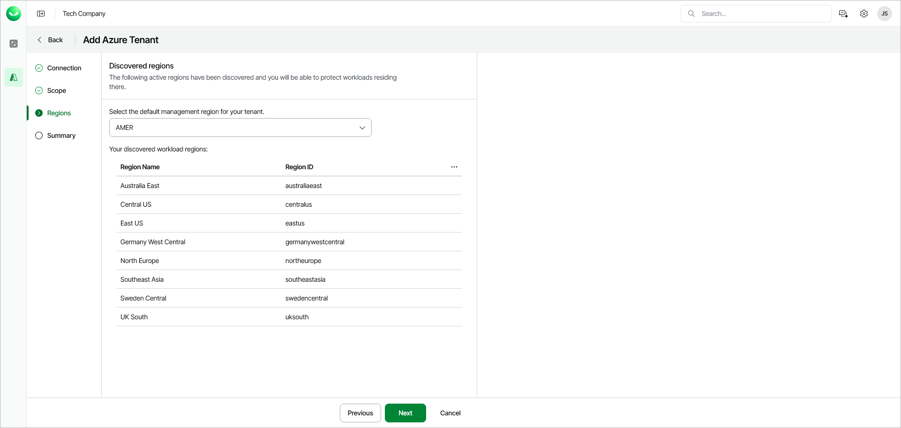

# Step 4. Select Default Management Region

At the Regions step of the wizard, select the default management region for your tenant. The default management region is a geographical location where Veeam Data Cloud will process your resources data. Veeam Data Cloud for Microsoft Azure offers the following management regions: AMER, APJ and EMEA.

To select the default management region, choose a region from the Select region drop-down list.

