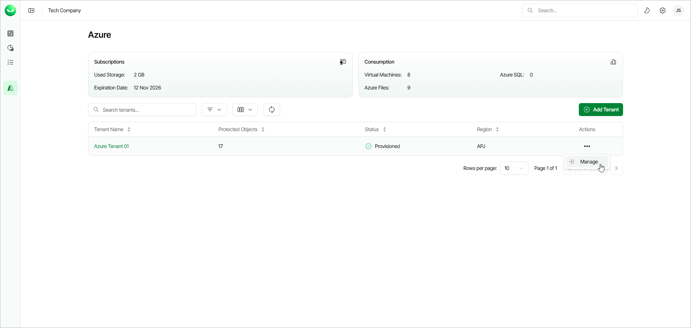

# Accessing Microsoft Azure Tenant Dashboard

To access the tenant dashboard, do the following:

1. On the Azure Management page, find the tenant in the list of tenants.
2. From the overflow menu in the Actions column, click Manage. To learn more about tenant dashboard, see [Viewing Dashboard](azure_dashboard.md).

