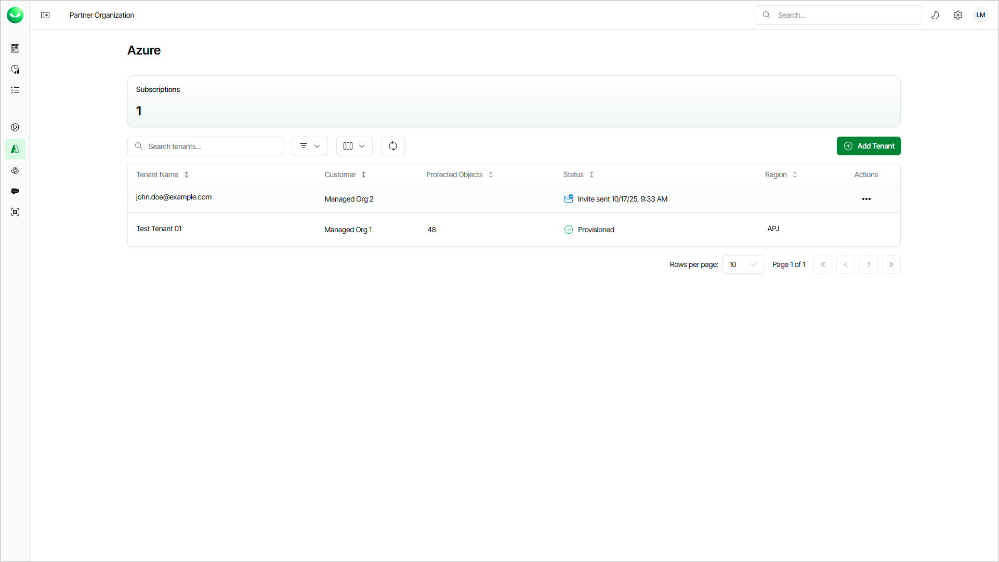

# Viewing Microsoft Azure Tenants

The Azure page provides an overview of the Veeam Data Cloud for Microsoft Azure subscriptions and workload tenants of your customers.

Subscription Information

The Active Subscription section shows the number of subscriptions your customers have assigned for this workload.

Workload Tenants

Veeam Data Cloud displays the following properties for each workload tenant:

| Property | Description |
| --- | --- |
| Tenant Name | Name that you specified when adding the tenant. If the tenant status is Invite Sent, this property shows the email address to which you sent the invitation. |
| Customer | Customer organization where the tenant is created. |
| Protected Objects | Total number of Azure resources that Veeam Data Cloud backs up in this tenant. |
| Status | Current status of the tenant. For details, see [Tenant Statuses](#tenantstatuses). |
| Region | Region where Veeam Data Cloud processes and stores backed-up data. |

Tenant Statuses

Each workload tenant can have one of the following statuses:

| Status | Description |
| --- | --- |
| Provisioning | Veeam Data Cloud is provisioning a new tenant with necessary backup infrastructure after you completed the Add Azure Tenant wizard. |
| Provisioned | The infrastructure for your tenant is ready, and you can manage your tenant. To manage a tenant, your account must have the Azure:Administrator role. |
| Provisioning Failed | The infrastructure deployment was not successful. To resolve the issue, [submit a support case](https://my.veeam.com/my-cases). |
| Invite Sent | You sent an email with an invitation to add a tenant to your customer and the customer has not added the tenant yet. The status also indicates the date when the invitation was sent. You can resend, edit or cancel the invitation. For details, see [Managing Invitations](sp_customers_invite_manage.md). |

