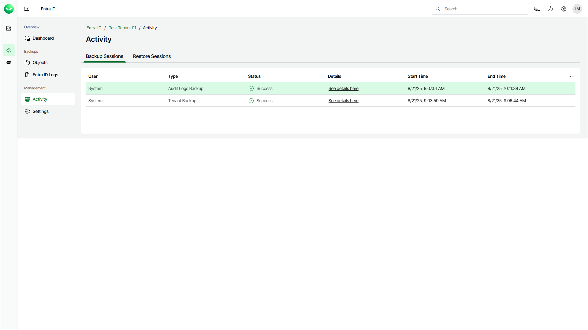

# Viewing Backup and Restore Sessions

You can view the history and statuses of restore and backup sessions. For each session, you can also view a detailed session log. This may be useful when you are looking for a reason why a backup or restore session failed.

To view backup or restore sessions, do the following:

1. On the Entra ID page, click the name of the tenant you want to manage.
2. Select Activity.
3. Select the Backup Sessions or Restore Sessions tab.

To display a window with detailed information about session events, click See details here next to the session whose details you want to display.

|  |
| --- |
| Note |
| * The detailed information about session events is available for 3 months. Later, only session information in the session list is available. * Veeam Data Cloud sends an email notification if a backup fails. Notifications for successful backups are sent only once, after the initial backup is completed. |

