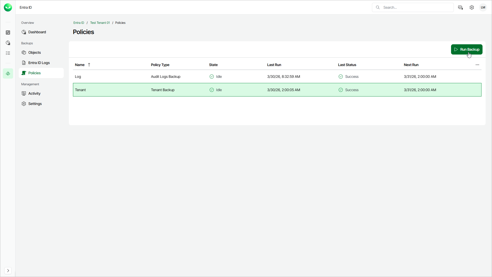

# Starting Backup Policies

You can manually start an Entra ID backup policy to create an immediate restore point for your Microsoft Entra ID objects and logs. This helps you reduce risk before you make sensitive configuration changes in your Microsoft Entra ID tenant when scheduled backups do not align with the planned time of the changes.

To start a backup policy, do the following:

1. On the Entra ID page, click the name of the tenant you want to manage.
2. Select Policies.
3. Select the backup policy you want to start:

* Select Log to back up your Entra ID audit logs.
* Select Tenant to back up your Entra ID objects.

1. Click Run Backup. Veeam Data Cloud will start the backup session and create a restore point.

