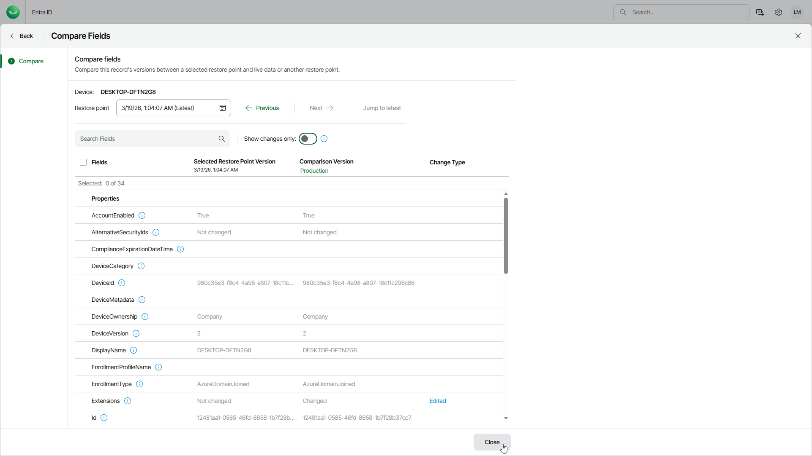

# Comparing Entra ID Device Properties

You can compare the property values of a Microsoft Entra ID device in a selected restore point with the values in production or in another restore point. Comparing device properties helps you identify which properties were modified and review the changes before exporting the device. You can export devices to JSON files for further import or restore into Microsoft Entra ID or compatible systems. For details on export, see [Entra ID Object Export](entra_id_object_export.md).

You can also view and copy BitLocker recovery keys associated with Microsoft Entra ID devices. For details, see [Viewing BitLocker Recovery Keys](entra_id_devices_view_bitlocker.md).

|  |
| --- |
| Note |
| The Entra ID device compare functionality is available only if you enable the backup of devices first and Veeam Data Cloud completes an Entra ID backup with this option enabled. For details, see [Settings](entra_id_settings.md#enabligcap). |

To compare property values of an Entra ID device, do the following:

1. On the Entra ID page, click the name of the tenant you want to manage.
2. Select Objects.
3. Make sure that the Devices tab is selected.
4. Select a device whose properties you want to compare.

|  |
| --- |
| Tip |
| To find a device by its display name, you can use the search field. |

1. Click Compare.
2. On the Compare Fields page, select a restore point and compare the property values.

* To find a restore point in the restore point calendar, click the Restore point field.
* To change the restore point, click the Previous and Next links.
* To select the latest restore point, click Jump to latest.

In the Selected Restore Point Version and Comparison Version columns, you can see property values at different points in time. By default, the Comparison Version column displays the current values in production. To change them to the values from a specific restore point, click Production and select the restore point.

1. By default, the list of properties shows only the properties that have changed. To show all properties, set the Show changes only toggle to Off.

