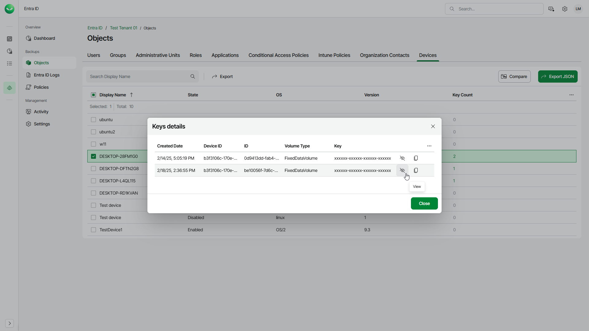

# Viewing BitLocker Recovery Keys

You can view and copy backed-up BitLocker recovery keys associated with Microsoft Entra ID devices. Quick access to BitLocker recovery keys simplifies device recovery and compliance audits. Veeam Data Cloud displays keys from the latest restore point.

|  |
| --- |
| Note |
| You can view and copy BitLocker recovery keys only after you enable the backup of Entra ID devices first and Veeam Data Cloud completes an Entra ID backup with this option enabled. For details, see [Settings](entra_id_settings.md#enabligcap). |

To view or copy the BitLocker keys of an Entra ID device, do the following:

1. On the Entra ID page, click the name of the tenant you want to manage.
2. Select Objects.
3. Make sure that the Devices tab is selected.
4. Click the number of keys in the Key Count column of the required device.
5. In the Keys details window, view or copy the key you need.

