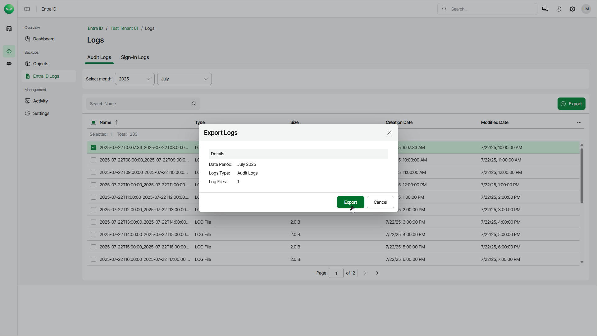

# Entra ID Log Restore

Entra ID log restore allows exporting Microsoft Entra ID audit and sign-in logs. After the restore session is finished, Veeam Data Cloud will create a shared access signature (SAS) URL that you can use in Microsoft Azure Storage Explorer to download the exported log files. For more information on Microsoft Azure Storage Explorer, see [Microsoft documentation](https://learn.microsoft.com/en-us/azure/storage/storage-explorer/vs-azure-tools-storage-manage-with-storage-explorer?tabs=windows).

To export audit and sign-in log files, do the following:

1. On the Entra ID page, click the name of the tenant you want to manage.
2. Select Entra ID Logs.
3. Select the Audit Logs or Sign-in Logs tab depending on the type of logs you want to export.
4. In the Select month field, specify the month when the logs you want to export were created.
5. In the list of backed-up log files, select those you want to export.
6. Click Export.
7. In the Export Logs window, click Export to start the restore session. Veeam Data Cloud will create a SAS link once the log files are exported and ready to download. You will receive an email notification once the export is completed successfully or fails.

1. To copy the SAS link:

1. Select Activity.
2. Select the Restore Sessions tab.
3. In the list of sessions, click See details here in the Details column of the logs restore session.
4. In the Session Details window, click Copy the Link.

The SAS link is valid for 2 hours. When the link expires, start a new restore session.

1. To download the exported log files, use the copied SAS link in Microsoft Azure Storage Explorer:

1. Download and install Microsoft Azure Storage Explorer. To get the download link, see the [Azure Storage Explorer product page](https://azure.microsoft.com/en-us/products/storage/storage-explorer/#Download-4).
2. In the Microsoft Azure Storage Explorer application, click Open Connect Dialog on the left to launch the Connect to Azure Storage wizard:

1. At the Select Resource step of the wizard, select Blob container or directory.
2. At the Select Connection Method step, select Shared access signature URL (SAS).
3. At the Enter Connection Info step, specify a display name of the connection and paste the SAS link to the Blob container or directory SAS URL field.
4. At the Summary step, click Connect to create the connection and close the wizard.

1. In the Explorer window, make sure that your new Blob container connection is selected.
2. On the connection tab, select the logs folder and click Download to download the exported logs.

